\newpage

# Quick Reference {#sec-quickref}

Outlined below are a few of the key concepts, files, and data structures that are essential for understanding and working with the freely-walking optomotor experiment pipeline. This section serves as a high-level overview and quick reference guide before diving into the detailed explanations in the subsequent sections.

## Pipeline at a Glance

1. **Run the experiment** -- `protocol_27.m` controls the LED arena and camera, producing a **UFMF video** and a **LOG.mat** file with stimulus timing.
2. **Track the flies** -- `FlyTracker` processes the video offline, producing `feat.mat` (features) and `trx.mat` (trajectories).
3. **Compute behavioral metrics** -- `combine_data_one_cohort(feat, trx)` filters bad tracking, interpolates gaps, and computes 12 behavioral metrics.
4. **Split by condition** -- `comb_data_one_cohort_cond(LOG, comb_data)` uses LOG frame indices to slice continuous data into per-condition segments.
5. **Merge experiments** -- `comb_data_across_cohorts_cond(protocol_dir)` combines all sessions into a single hierarchical DATA struct.

Steps **2**-**3** can be fully automated -- see @sec-automation.

## Key Files

\begin{footnotesize}
\begin{longtable}{p{6.5cm} p{8cm}}
\textbf{File} & \textbf{Purpose} \\
\hline
\endhead
\texttt{protocols/protocol\_27.m} & Example protocol script (defines conditions, runs experiment). Main protocol used for screen. \\
\texttt{protocols/protocol\_functions/} & 14 shared functions for initialization, stimulus, acclimation \\
\texttt{processing\_functions/\newline process\_freely\_walking\_data.m} & Top-level processing entry point (by date) \\
\texttt{processing\_functions/\newline process\_data\_features.m} & Single-experiment processing orchestrator \\
\texttt{processing\_functions/functions/\newline combine\_data\_one\_cohort.m} & Core: computes 12 behavioral metrics from tracking data \\
\texttt{processing\_functions/functions/\newline comb\_data\_one\_cohort\_cond.m} & Splits continuous data by condition using LOG frame indices \\
\texttt{processing\_functions/functions/\newline comb\_data\_across\_cohorts\_cond.m} & Merges experiments into final DATA struct \\
\hline
\texttt{monitor\_and\_copy\_folder/\newline monitor\_and\_copy.py} & Automated copy from acquisition PC to network \\
\texttt{monitor\_and\_track\_folder/\newline monitor\_and\_track.py} & Automated FlyTracker batch tracking \\
\texttt{daily\_processing/\newline daily\_processing.py} & Automated daily processing and result distribution \\
\texttt{tracking/batch\_track\_ufmf.m} & Batch FlyTracker invocation for one date folder \\
\end{longtable}
\end{footnotesize}

## Behavioral Metrics Quick Reference

| Metric | Field | Units | Typical Range | Description |
|:-------|:---------|:-----|:--------|:------------|
| Forward velocity | `fv_data` | mm/s | 0--30 | Speed along heading direction |
| Angular velocity | `av_data` | deg/s | -500 to +500 | Heading change rate (turning speed) |
| Turning rate | `curv_data` | deg/mm | Variable | Path curvature (av / fv) |
| Distance from center | `dist_data` | mm | 0--120 | Distance from arena center |
| Three-point velocity | `vel_data` | mm/s | 0--50 | Overall speed (any direction) |
| Viewing distance | `view_dist` | mm | 0--240 | Distance to wall along heading |
| Inter-fly distance | `IFD_data` | mm | 0--240 | Distance to nearest fly |
| Inter-fly angle | `IFA_data` | deg | -180 to 180 | Angle to nearest fly vs heading |
| X position | `x_data` | mm | -120 to 120 | Horizontal position |
| Y position | `y_data` | mm | -120 to 120 | Vertical position |
| Heading (unwrapped) | `heading_data` | deg | Continuous | Cumulative heading angle |
| Heading (wrapped) | `heading_wrap` | deg | -180 to 180 | Heading within one revolution |

## Common MATLAB Access Patterns

```matlab
% Load combined data
DATA = comb_data_across_cohorts_cond( ...
    '/path/to/results/protocol_27');

% Access forward velocity:
%   strain, sex F, cohort 1, Rep 1 condition 1
fv = DATA.jfrc100_es_shibire_kir ...
    .F(1).R1_condition_1.fv_data;
%   fv is [n_flies x n_frames]

% Mean across flies at each timepoint
mean_fv = mean(fv, 1, 'omitnan');

% Number of cohorts for a strain/sex
n_cohorts = length( ...
    DATA.jfrc100_es_shibire_kir.F);

% List all strains
strain_names = fieldnames(DATA);
```

## Glossary of Key Terms

| Term | Definition |
|:---|:-------------|
| **LOG** | MATLAB struct saved during experiment; contains stimulus timing, metadata, and frame indices |
| **comb_data** | Intermediate struct with 12 behavioral metric matrices for one experiment |
| **DATA** | Final hierarchical struct organizing all experiments by strain, sex, cohort, and condition |
| **FlyTracker** | Offline tracking software that extracts fly positions and features from video |
| **UFMF** | Micro Fly Movie Format -- compressed video format used by the overhead camera |
| **Panel_com** | MATLAB function that sends commands to the G3 LED arena controller |
| **BIAS** | Camera control software (Basic Image Acquisition Software) |
| **G3 arena** | Cylindrical LED display (72 panels, 3 rows x 192 columns) |
| **PPM** | Pixels per millimeter (calibration constant: 4.1691) |
| **Condition** | One stimulus configuration (pattern + speed + duration) |
| **Repetition** | One complete pass through all conditions (each experiment has 2 reps) |
| **Cohort** | One experimental session (one group of flies) |
| **watchdog** | Python library for filesystem event monitoring; used by `monitor_and_copy.py` |
| **Task Scheduler** | Windows service that runs batch files on a schedule; launches all automation scripts |
| **0_unprocessed** | Network directory for raw experiment data awaiting tracking |
| **1_tracked** | Network directory for tracked data awaiting MATLAB processing |
| **2_processed** | Network directory for fully processed data ready for analysis |


\newpage

# Introduction and Overview {#sec-intro}

::: {.callout-note appearance="default" icon=false}

## **At a Glance**

- Flies walk freely within a cylindrical arena while visual patterns are displayed on LED panels around the circumference facing inwards.
- An overhead camera records behavior at 30 fps in near infra-red light and saves the data in the compressed UFMF format.
- A MATLAB protocol script controls the arena and logs stimulus timing and parameters.
- The primary response measured is the **optomotor response** (corrective turning in the direction of motion).
- Data flows through 5 stages: experiment, tracking, metrics, condition-splitting, merging across cohorts of the same genetic strain.
:::

## Overview of the Freely-Walking Optomotor Experiments

These experiments study the visual-motor behaviour of freely-walking *Drosophila melanogaster* (fruit flies) inside a cylindrical LED arena (3rd generation - G3 arena). Groups of between 10-20 flies (ideally 15) walk freely on a flat surface of the underlying LED backlight while visual patterns -- such as moving gratings, curtains, or stationary bars -- are displayed on the surrounding LED panels. An overhead camera records the flies' behavior at 30 frames per second.

The primary behavioural response measured is the **optomotor response**: when a grating pattern moves across the visual field, walking flies tend to turn in the direction of motion. By varying stimulus parameters (pattern type, speed, contrast, spatial frequency), we can probe the neural circuits underlying motion detection. The experiments also include control conditions (e.g., static patterns, dark intervals) and a pre/post-stimulus acclimation period in darkness to measure baseline behavior. 

In the summer of 2024, while performing the first round of these experiments, we observed another behaviour that we call the **centring response**: while the grating stimuli are being presented and flies perform the well-characterised optomotor turning, they also tend to walk towards the center of the arena. The response was colloquially given the moniker the *"hokey-cokey"* after its resemblance to the centripetal movement within the group dance performed by several cultures around the world. Many of the protocols designed for this arena were designed to try and. investigate this centring behaviour, it's reliance on stimulus parameters and its interaction with the optomotor response.

**Arena geometry:**

- 72 LED panels arranged in a cylinder (3 rows of 24 panels)
- Each panel is 8 x 8 pixels, giving 3 rows x 192 columns total
- Arena radius: approximately 120 mm
- Video recording at 30 fps in UFMF (compressed) format
- The LEDs emit light with a peak in the green range of the visible spectrum (~500nm). 

## The Full Data Pipeline

The data flows through several stages from experiment to analysis:

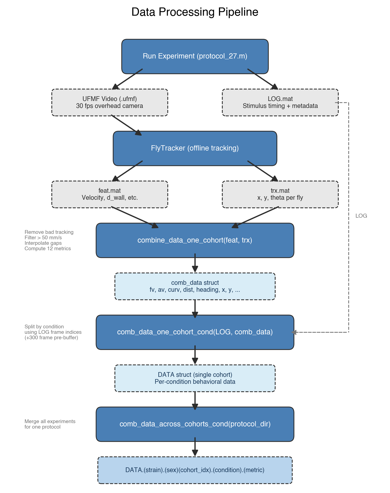{#fig-pipeline width=100%}

\newpage

1. **Run the experiment** -- A MATLAB protocol script controls the LED arena and camera, producing a UFMF video file and a LOG.mat file with stimulus timing.
2. **Track the flies** -- FlyTracker (offline software) processes the video to extract each fly's position, heading, and basic features, producing `feat.mat` and `trx.mat`.
3. **Compute behavioral metrics** -- `combine_data_one_cohort` filters bad tracking, interpolates gaps, and computes 12 behavioral metrics (forward velocity, angular velocity, turning rate, etc.).
4. **Split by condition** -- `comb_data_one_cohort_cond` uses the LOG frame indices to separate the continuous data into per-condition segments.
5. **Merge experiments** -- `comb_data_across_cohorts_cond` combines data from multiple experimental sessions into a single hierarchical DATA struct for group analysis.

Steps **2** and **3** are automated by the pipeline scripts described in @sec-automation. When running, the automation handles copying, tracking, and processing without manual intervention.


\newpage

# Automated Data Pipeline {#sec-automation}

::: {.callout-note appearance="default" icon=false}
## **At a Glance**

- Three Python scripts (written by **Aparna Dev**) automate data flow from the acquisition PC to processed results
- **Stage 1:** `monitor_and_copy.py` watches the acquisition PC and copies completed experiments to the network
- **Stage 2:** `monitor_and_track.py` polls the network, runs FlyTracker batch tracking, and moves data to `1_tracked`
- **Stage 3:** `daily_processing.py` runs `process_freely_walking_data` on tracked data and distributes results to the network
- The scripts run on two different physical PCs and communicate via shared network directories
:::

## Overview

The automated data pipeline eliminates manual file management between running an experiment and analysing the results. Three Python scripts, launched via Windows Task Scheduler batch files, handle the progression of data through a series of network directories. Each script monitors for new data, processes it, and advances it to the next stage.

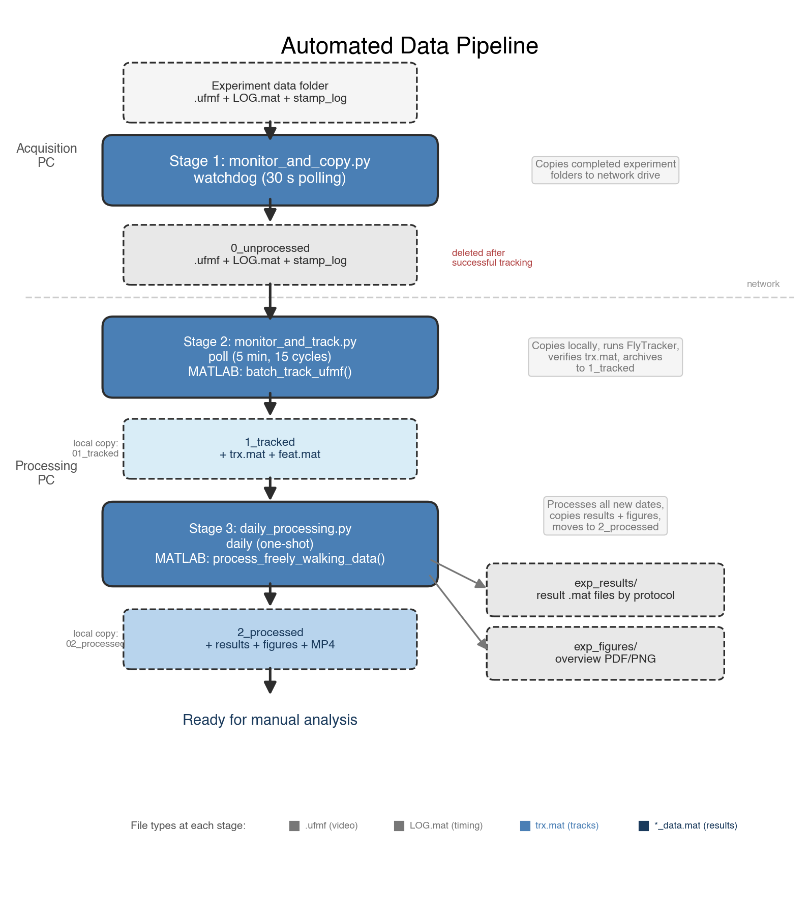{#fig-automation width=100%}

\newpage

**Three-stage summary:**

\begingroup\footnotesize
\begin{tabularx}{\textwidth}{l l l X X l}
\hline
\textbf{Stage} & \textbf{Script} & \textbf{Runs On} & \textbf{Input} & \textbf{Output} & \textbf{Polling} \\
\hline
1. Copy & \texttt{monitor\_and\_\newline copy.py} & Acquisition PC & Local experiment data & Network \texttt{0\_unprocessed} & 30\,s (watchdog) \\
2. Track & \texttt{monitor\_and\_\newline track.py} & Processing PC & Network \texttt{0\_unprocessed} & Network \texttt{1\_tracked} & 5\,min, 15 cycles \\
3. Process & \texttt{daily\_\newline processing.py} & Processing PC & Local \texttt{01\_tracked} & Network \texttt{2\_processed} & One-shot (daily) \\
\hline
\end{tabularx}
\endgroup


**Network directory progression:**

| Directory | Contents | State |
|:-----|:--------------|:------|
| `0_unprocessed` | Raw experiment folders (.ufmf + LOG.mat + stamp_log) | Awaiting tracking |
| `1_tracked` | Tracked folders (+ trx.mat, feat.mat) | Awaiting processing |
| `2_processed` | Fully processed folders (+ MP4 videos) | Complete |
| `exp_results` | Result .mat files organized by protocol | Analysis ready |
| `exp_figures` | Overview figures (PDF/PNG) | QC and review |

All network directories reside on the Janelia network share at `\\prfs.hhmi.org\reiserlab\oaky-cokey\data\`.

::: {.callout-tip appearance="default" icon=false}

## **Completeness check:** 
A folder is considered "complete" (ready to be advanced to the next stage) when it contains at least one `.ufmf` file, at least one `.mat` file, and a file whose name starts with `stamp_log`. This ensures the experiment has finished writing all outputs before any copying or processing begins.

:::

## Stage 1: Monitoring and Copying

### \colorbox{fnbg}{\texttt{monitor\_and\_copy.py}} \label{fn:monitor_and_copy}

**Purpose:** Watches the acquisition PC's data folder for new experiment directories and copies completed experiments to the network `0_unprocessed` directory.

**Where it runs:** Acquisition PC (Windows, user `labadmin`). This is a different physical machine and user account from the processing scripts.

**Mechanism:**

1. Uses the Python `watchdog` library to create a filesystem `Observer` that monitors the acquisition data folder (see paths below) recursively for new directories
2. When a new directory is detected (`on_created` event), it is added to a `pending_folders` set
3. Every 30 seconds, the script iterates through pending folders and checks completeness via `is_folder_complete()`
4. Complete folders are copied to the network using `shutil.copytree()` with `dirs_exist_ok=True`, preserving the full relative path from the source root (so the `{date}/{protocol}/{strain}/{sex}/{time}/` hierarchy is maintained)
5. The script runs indefinitely until manually stopped (Ctrl+C)

**Paths:**

- Source: `C:\MatlabRoot\FreeWalkOptomotor\data`
- Destination: `\\prfs.hhmi.org\reiserlab\oaky-cokey\data\0_unprocessed`

**Logging:** `monitor_and_copy.log` in the script directory.

**Launcher:** `run_monitor_and_copy.bat` sets the Python path and working directory. Designed to be registered as a Windows Task Scheduler task that runs on login.


## Stage 2: Automated Tracking

### \colorbox{fnbg}{\texttt{monitor\_and\_track.py}} \label{fn:monitor_and_track}

**Purpose:** Polls the network `0_unprocessed` directory for completed experiment folders, copies them locally, runs MATLAB FlyTracker batch tracking, and on success moves the tracked data to `1_tracked` on the network and the local archive.

**Where it runs:** Processing PC (Windows, user `burnettl`).

**Mechanism:** Polling-based (not watchdog). Scans the network directory every 5 minutes (`SCAN_INTERVAL = 300`). Has an inactivity timer: 15 consecutive scan cycles with no new data triggers auto-exit (15 x 5 min = 75 minutes of inactivity). The counter resets to 0 whenever new data is processed.

**Processing flow for each untracked folder:**

1. `has_been_processed()` -- checks if the folder already exists in `1_tracked` or `2_processed` on the network. Skips if found.
2. `is_folder_complete()` -- same completeness check as Stage 1 (.ufmf + .mat + stamp_log).
3. `copy_to_local()` -- copies from network `0_unprocessed` to local `00_unprocessed` (avoids tracking over the network, which would be extremely slow).
4. `run_matlab_tracking()` -- invokes MATLAB in batch mode:

```
matlab -batch "cd('<folder>'); batch_track_ufmf('<folder>')"
```

5. `tracking_successful()` -- walks the folder tree looking for `trx.mat`. Its presence confirms FlyTracker completed successfully.
6. `move_to_tracked()` -- performs four operations: (a) copy to local `01_tracked` archive, (b) move from local `00_unprocessed` to network `1_tracked`, (c) clean up empty parent directories locally, (d) delete the original from network `0_unprocessed` and clean up empty parents.

**Path constants:**

\begingroup\footnotesize
\begin{tabularx}{\textwidth}{l X}
\hline
\textbf{Variable} & \textbf{Path} \\
\hline
\texttt{GROUP\_DRIVE\_PATH} & \texttt{\textbackslash{}\textbackslash{}prfs.hhmi.org\textbackslash{}...\textbackslash{}data\textbackslash{}0\_unprocessed} \\
\texttt{LOCAL\_PATH} & \texttt{C:\textbackslash{}...\textbackslash{}oakey-cokey\textbackslash{}DATA\textbackslash{}00\_unprocessed} \\
\texttt{TRACKED\_PATH} & \texttt{\textbackslash{}\textbackslash{}prfs.hhmi.org\textbackslash{}...\textbackslash{}data\textbackslash{}1\_tracked} \\
\texttt{TRACKED\_LOCAL\_PATH} & \texttt{C:\textbackslash{}...\textbackslash{}oakey-cokey\textbackslash{}DATA\textbackslash{}01\_tracked} \\
\texttt{PROCESSED\_PATH} & \texttt{\textbackslash{}\textbackslash{}prfs.hhmi.org\textbackslash{}...\textbackslash{}data\textbackslash{}2\_processed} \\
\hline
\end{tabularx}
\endgroup

**Launcher:** `run_monitor_and_track.bat` creates a dated log file in `monitor_and_track_logs/`.


### \colorbox{fnbg}{\texttt{batch\_track\_ufmf.m}} \label{fn:batch_track_ufmf}

**Purpose:** Batch-processes all UFMF video files in a given experiment folder using FlyTracker's `simple_noninteractive_flytracker()`.

**Location:** `tracking/batch_track_ufmf.m`

**How it works:**

1. Recursively finds all `.ufmf` files under the input folder
2. Loads the base calibration file from `tracking/calibration.mat`
3. For each video folder:
   - Reads the experiment's `LOG.mat` to get `LOG.meta.n_flies`
   - Updates the calibration struct with the actual fly count
   - Saves a per-experiment `calibration.mat` in the video folder
   - Calls `simple_noninteractive_flytracker()` with the video and calibration
4. Produces `trx.mat` (trajectories) and `feat.mat` (features) within each video's output folder
5. Saves a tracking-time log table to `tracking_log/Tracked_{date}.mat`

**Tracking options:**

| Option | Value | Description |
|:-------|:------|:------------|
| `num_chunks` | 16 | Parallel processing chunks |
| `num_cores` | 8 | CPU cores to use |
| `max_minutes` | Inf | No time limit |
| `save_JAABA` | 1 | Save JAABA-compatible output |
| `save_seg` | 0 | Don't save segmentation |
| `force_calib` | 1 | Force calibration usage |
| `do_recompute_tracking` | 1 | Recompute if output exists |

**Other files in `tracking/`:**

- `calibration.mat` -- base FlyTracker calibration (arena geometry, background model, detection thresholds)
- `batch_track_ufmf_p27.m` -- legacy version that only processes `protocol_27` folders (no longer used by automation)
- `export_tracks_stim_only.m` -- utility to extract tracking data for specific frame ranges
- `retrack_by_date_with_calib_file.m` -- manual retracking script for specific date ranges


## Stage 3: Daily Processing

### \colorbox{fnbg}{\texttt{daily\_processing.py}} \label{fn:daily_processing}

**Purpose:** Processes all tracked-but-unprocessed date folders by running MATLAB `process_freely_walking_data()`, then distributes results and figures to the network.

**Where it runs:** Processing PC (Windows, user `burnettl`).

**Mechanism:** One-shot execution (not a polling loop). Runs once and exits. Designed to be scheduled once daily via Windows Task Scheduler.

**Processing flow:**

1. `list_date_folders()` -- scans `LOCAL_TRACKED` for directories matching the date pattern `YYYY_MM_DD` (any year) using the regular expression `^\d{4}_\d{2}_\d{2}$`.
2. Compares tracked dates against `LOCAL_PROCESSED` to identify unprocessed dates.
3. For each new date: calls `run_matlab_function()` which invokes:

```
matlab -batch "process_freely_walking_data('YYYY_MM_DD')"
```

4. `has_results_for_date()` -- searches the results directory for any file starting with the date string.
5. `copy_results_to_network()` -- copies result `.mat` files to the network `exp_results` directory, preserving protocol folder structure.
6. `copy_figs_to_network()` -- copies `.pdf` and `.png` figure files to the network `exp_figures\overview_figs` directory.
7. `move_folder()` -- moves date folder from `01_tracked` to `02_processed` (both local and network). **Warning: if the destination folder already exists, `shutil.move` creates a nested structure -- see @sec-pitfalls.**
8. `copy_mp4s_to_network()` -- copies generated `.mp4` video files to network `2_processed`.

**Path constants:**

\begingroup\footnotesize
\begin{tabularx}{\textwidth}{l X}
\hline
\textbf{Variable} & \textbf{Path} \\
\hline
\texttt{LOCAL\_TRACKED} & \texttt{C:\textbackslash{}...\textbackslash{}oakey-cokey\textbackslash{}DATA\textbackslash{}01\_tracked} \\
\texttt{LOCAL\_PROCESSED} & \texttt{C:\textbackslash{}...\textbackslash{}oakey-cokey\textbackslash{}DATA\textbackslash{}02\_processed} \\
\texttt{NETWORK\_TRACKED} & \texttt{\textbackslash{}\textbackslash{}prfs.hhmi.org\textbackslash{}...\textbackslash{}data\textbackslash{}1\_tracked} \\
\texttt{NETWORK\_PROCESSED} & \texttt{\textbackslash{}\textbackslash{}prfs.hhmi.org\textbackslash{}...\textbackslash{}data\textbackslash{}2\_processed} \\
\texttt{LOCAL\_RESULTS\_ROOT} & \texttt{C:\textbackslash{}...\textbackslash{}oakey-cokey\textbackslash{}results} \\
\texttt{NETWORK\_RESULTS\_ROOT} & \texttt{\textbackslash{}\textbackslash{}prfs.hhmi.org\textbackslash{}...\textbackslash{}oaky-cokey\textbackslash{}exp\_results} \\
\texttt{LOCAL\_FIGS\_ROOT} & \texttt{C:\textbackslash{}...\textbackslash{}oakey-cokey\textbackslash{}figures\textbackslash{}overview\_figs} \\
\texttt{NETWORK\_FIGS\_ROOT} & \texttt{\textbackslash{}\textbackslash{}prfs.hhmi.org\textbackslash{}...\textbackslash{}exp\_figures\textbackslash{}overview\_figs} \\
\hline
\end{tabularx}
\endgroup

**Launcher:** `run_daily_processing.bat` creates a dated log file in `processing_logs/`.


## Supporting Scripts

### \colorbox{fnbg}{\texttt{reprocessing\_script.py}}

A variant of `daily_processing.py` designed for **reprocessing ALL dates** in `01_tracked`, regardless of whether they have been processed before. Used when processing logic changes and all data needs to be regenerated.

Key differences from `daily_processing.py`:

- Processes every date folder (does not skip dates already in `02_processed`)
- The `move_folder()` function uses `shutil.rmtree(dst)` to delete the existing destination before moving, avoiding the nesting bug but at the cost of destroying existing data

### \colorbox{fnbg}{\texttt{copy\_movies\_to\_network.py}}

A standalone utility that syncs `.mp4` video files from local `02_processed` to network `2_processed`. Useful for catching up on video transfers when the daily processing pipeline skipped the copy step or when video recording failed for some experiments. Logs folders with missing videos to `missing_videos_log.txt`.


## Configuration and Deployment

**Physical machine layout:**

| Machine | Role | Windows User | Scripts |
|:-----|:-------|:-----|:---------|
| Acquisition PC | Runs experiments, captures video | `labadmin` | `monitor_and_copy.py` |
| Processing PC | FlyTracker tracking, MATLAB processing | `burnettl` | `monitor_and_track.py`, `daily_processing.py` |

**Windows Task Scheduler setup:**

- `run_monitor_and_copy.bat` should run continuously on the acquisition PC (triggered on login). It monitors indefinitely until stopped.
- `run_monitor_and_track.bat` should run on the processing PC, triggered after expected experiment completion times. It auto-exits after 75 minutes of inactivity.
- `run_daily_processing.bat` should run once daily on the processing PC, after tracking is expected to finish. It executes once and exits.

**Dependencies:**

- Python 3.13 (standalone installation on the acquisition PC; the pixi environment can also be used on the processing PC)
- `watchdog` library (required by `monitor_and_copy.py`; listed in `pixi.toml` and also installed via `pip` on the acquisition PC)
- MATLAB with FlyTracker (`simple_noninteractive_flytracker`) on the system PATH
- Network drive `\\prfs.hhmi.org\reiserlab\oaky-cokey\` must be accessible from both PCs

::: {.callout-warning appearance="default" icon=false}
## **Known Limitations**

The automation scripts were developed for rapid deployment and contain several hardcoded assumptions. See @sec-pitfalls for a complete list. The most impactful remaining issues are: the lack of a shared configuration file (all paths are duplicated across scripts), the `move_folder()` nesting bug in `daily_processing.py`, and the absence of retry logic for network operations.
:::


\newpage

# Running an Experiment -- Protocol Functions {#sec-protocol}

::: {.callout-note appearance="default" icon=false}
## **At a Glance**

- A protocol file (e.g., `protocol_27.m`) orchestrates the entire experiment
- 14 shared functions in `protocols/protocol_functions/` handle initialization, stimulus, and acclimation
- Each experiment has: acclimation, flashes, 2 repetitions of all conditions, final acclimation
- All timing (frame counts and timestamps) is logged in the LOG struct
- Temperature is recorded at the start and end of every phase
:::

## Overview of Protocol Structure

A protocol file (e.g., `protocol_27.m`) is a MATLAB script that orchestrates the entire experiment. It defines the stimulus conditions, calls initialization functions, presents stimuli in randomized order, and saves all timing data.

The protocol calls functions from the `protocols/protocol_functions/` directory. There are 14 functions in this directory, organized into four categories: initialization, stimulus presentation, acclimation, and data export.

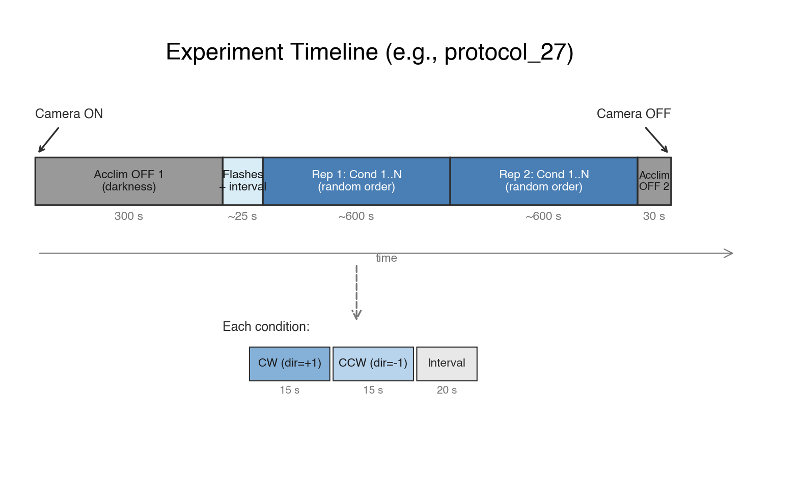{#fig-timeline width=100%}

### Typical Experiment Flow (protocol_27.m)

1. Initialize camera, folders, and metadata (`initialize_video_and_folders`)
2. Initialize temperature recording (`initialize_temp_recording`)
3. Start camera capture
4. **Acclimation OFF 1** -- 300s of recording in complete darkness (`present_acclim_off`, rep=1)
5. **Full-field flashes** -- 5s calibration flashes (pattern 48), then 20s dark interval
6. **Repetition 1** -- Present all conditions once in random order
7. **Repetition 2** -- Present all conditions again in a new random order
8. **Acclimation OFF 2** -- 30s of dark recording (`present_acclim_off`, rep=2)
9. Stop camera, save LOG.mat, export metadata to Google Sheets


Each condition consists of:

- 2 stimulus trials (15s each, alternating CW and CCW directions)
- 1 interval (20s, dark background pattern)


## Initialization Functions

### \colorbox{fnbg}{\texttt{get\_input\_parameters.m}} \label{fn:get_input_parameters}

**Purpose:** Opens a GUI dialog to capture experimental metadata before each experiment.

**Inputs:** None

**Outputs:** `selections` struct with fields:

| Field | Options | Default |
|:----|:----------|:------|
| `nFlies` | 1--20 | 15 |
| `Experimenter` | GraceBiondi, AparnaDev, LauraBurnett, other | GraceBiondi |
| `Strain` | 28 strain options (csw1118, jfrc100_es_shibire_kir, RNAi controls, etc.) | jfrc100_es_shibire_kir |
| `Age` | 1--8, >8, age ranges (1-2, 2-3, ...), NaN | 4 |
| `Sex` | F, M, NaN | F |
| `LightCycle` | 20:00_12:00, 01:00_17:00, NaN | 01:00_17:00 |

This metadata is stored in the LOG struct and exported to Google Sheets for experiment tracking.

### \colorbox{fnbg}{\texttt{initialize\_video\_and\_folders.m}} \label{fn:initialize_video_and_folders}

**Purpose:** Sets up the camera, creates the folder hierarchy for data storage, and initializes the LOG struct.

**Inputs:**

- `project_data_folder` -- root data directory (e.g., `C:\MatlabRoot\FreeWalkOptomotor\data`)
- `func_name` -- protocol name (e.g., `"protocol_27"`)

**Outputs:**

- `LOG` -- metadata struct (with `LOG.meta` subfield)
- `vidobj` -- BIAS camera interface object
- `exp_folder` -- full path to experiment folder
- `date_str`, `t_str` -- date and time strings
- `params` -- augmented parameter struct

**What it does:**

1. Calls `get_input_parameters()` to collect metadata via GUI
2. Connects to the BIAS camera on `localhost:5010`
3. Creates a nested folder hierarchy:

```
data/{date}/{protocol}/{strain}/{sex}/{time}/
```

4. Configures video recording (UFMF format, prefix `REC_`)
5. Creates `LOG.meta` with fields: `date`, `time`, `func_name`, `fly_strain`, `fly_age`, `fly_sex`, `light_cycle`, `experimenter`, `n_flies`
6. Prompts for start-of-experiment notes

### \colorbox{fnbg}{\texttt{initialize\_temp\_recording.m}} \label{fn:initialize_temp_recording}

**Purpose:** Configures a National Instruments DAQ for temperature monitoring.

**Inputs:** None

**Outputs:** `d` -- DAQ session object

**Configuration:**

- Device: cDAQ1Mod1 (National Instruments CompactDAQ)
- Channel ai0: `outside_probe` (K-type thermocouple) -- ambient temperature
- Channel ai1: `ring_probe` (K-type thermocouple) -- arena ring temperature
- Sampling rate: 2 Hz

### \colorbox{fnbg}{\texttt{get\_temp\_rec.m}} \label{fn:get_temp_rec}

**Purpose:** Reads a single temperature measurement from both probes.

**Inputs:** `d` -- DAQ session object

**Outputs:** `t_outside` (ambient), `t_ring` (arena ring) -- temperature in degrees C

**How it works:** Reads 1 second of data from the DAQ and extracts the first sample from each channel. Called at the start and end of each stimulus condition and acclimation period.


## Stimulus Presentation Functions

All stimulus presentation functions share a common pattern:

1. Record temperature at start
2. Extract parameters from the `all_conditions` matrix row
3. Present stimulus trials (varying by function type)
4. Present interval pattern
5. Record temperature at end
6. Return a `Log` struct with timing and parameter data

### The `all_conditions` Matrix

Each protocol defines an `all_conditions` matrix with columns:

| Column | Field | Description |
|:------:|:------|:------------|
| 1 | pattern_id | LED pattern number for the stimulus |
| 2 | interval_id | LED pattern for the interval (usually 47 = dark) |
| 3 | speed_patt | Stimulus animation speed (0--127) |
| 4 | speed_int | Interval animation speed (usually 0 or 1) |
| 5 | trial_dur | Duration of each trial in seconds |
| 6 | int_dur | Duration of the interval in seconds |
| 7 | condition_n | Condition number (for identification) |

**Speed values:**

| Speed Value | Approximate Rate |
|:-----------:|:-----------------|
| 0 | Static (no motion) |
| 1 | Minimal (fixation) |
| 8 | ~4 Hz |
| 32 | ~16 Hz |
| 64 | ~32 Hz |
| 127 | Maximum (~63 Hz) |

### Variant Comparison

All six `present_optomotor_stimulus` variants share the same signature and core structure: extract condition parameters, run stimulus trials with `Panel_com`, and log frame timestamps and temperatures. The table below summarises their key differences.

\begingroup\footnotesize
\begin{tabularx}{\textwidth}{l l l l l X}
\hline
\textbf{Variant} & \textbf{Trials} & \textbf{Direction} & \textbf{Interval} & \textbf{Swap?} & \textbf{Special Feature} \\
\hline
\texttt{(base)} & 2 & Alternates $\pm$1 & After all trials & No & \texttt{t\_stim = trial\_len $\times$ 2} \\
\texttt{\_w\_interval} & Col.\,7 & +1 then $-$1 & After every trial & No & Col.\,7 = \texttt{num\_trials} \\
\texttt{\_one\_direction} & 1 & +1 only & After the trial & No & Simplest variant \\
\texttt{\_curtain} & 15 or 2 & Alternates $\pm$1 & After all trials & Yes & Swaps paired pattern on trial\,2 \\
\texttt{\_curtain\_\newline w\_interval} & Col.\,7 & +1 then $-$1 & After every trial & Yes & Curtain swap + per-trial intervals \\
\texttt{\_diff\_contrasts} & 2 & Alternates $\pm$1 & After all trials & No & Y-axis selects contrast level \\
\hline
\end{tabularx}
\endgroup


\vspace{0.5em}

**Key notes:**

- **Interval placement** is the biggest structural split. The `_w_interval` variants log the interval as its own trial entry inside the loop, producing longer arrays that alternate stimulus/interval.
- **Curtain variants** load a paired pattern on trial 2 via a hardcoded `switch` block because curtain patterns are directionally asymmetric.
- **`_diff_contrasts`** is unique in using the pattern's **y-axis** (`set_position([1, which_condition])`) to index into contrast levels, while all others use `[1, 1]`.
- **Column 7 meaning changes:** In `_w_interval` and `_curtain_w_interval`, column 7 of `all_conditions` is `num_trials`. In all other variants, column 7 is `which_condition`.

### \colorbox{fnbg}{\texttt{present\_optomotor\_stimulus.m}} -- Standard Bidirectional \label{fn:present_optomotor_stimulus}

**Purpose:** Presents a moving grating pattern in two directions (CW then CCW), followed by a dark interval.

**Inputs:** `current_condition` (index), `all_conditions` (matrix), `vidobj` (camera), `d` (DAQ)

**Outputs:** `Log` struct

**Step-by-step:**

1. Record start temperature
2. Extract condition parameters from `all_conditions(current_condition, :)`
3. Calculate `num_trials = 2` (always: `t_stim = trial_len * 2`, then `num_trials = t_stim / trial_len`)
4. Load the stimulus pattern via `Panel_com('set_pattern_id', pattern_id)`
5. **Trial loop** (2 iterations):
   - Alternate direction: `dir_val` flips between +1 and -1 each trial
   - Set speed and direction: `Panel_com('send_gain_bias', [speed * dir_val, 0, 0, 0])`
   - Start the LED panels: `Panel_com('start')`
   - **Log `start_f` and `start_t`** from the camera (`vidobj.getFrameCount()` and `vidobj.getTimeStamp()`)
   - Pause for `trial_len` seconds (the stimulus runs during this pause)
   - Stop the panels: `Panel_com('stop')`
   - **Log `stop_f` and `stop_t`** from the camera
6. **Interval phase:**
   - Load interval pattern (pattern 47, dark background)
   - Set direction to 0 (no motion)
   - Log start/stop frame counts and timestamps
   - Pause for `interval_dur` seconds
7. Record end temperature

**Log structure returned:**

- `Log.trial` = [1, 2, 3] -- trial indices
- `Log.dir` = [+1, -1, 0] -- directions (CW, CCW, interval)
- `Log.start_t`, `Log.start_f` = [t1, t2, t3] -- timestamps and frame counts at onset
- `Log.stop_t`, `Log.stop_f` = [t1, t2, t3] -- timestamps and frame counts at offset
- Plus: `trial_len`, `interval_dur`, `num_trials`, `optomotor_pattern`, `interval_pattern`, `optomotor_speed`, `interval_speed`, `which_condition`, and four temperature readings

### \colorbox{fnbg}{\texttt{present\_optomotor\_stimulus\_w\_interval.m}} -- Per-Trial Intervals \label{fn:present_optomotor_stimulus_w_interval}

**Difference from standard:** Instead of one interval after all trials, this function inserts a dark interval **after each trial**. This creates a log with alternating stimulus and interval entries.

The `num_trials` value comes directly from `all_conditions` column 7 (not derived from trial length). First trial direction is +1, subsequent trials use -1.

**Log structure:** Arrays are longer, alternating between stimulus entries (dir = +1 or -1) and interval entries (dir = 0).

### \colorbox{fnbg}{\texttt{present\_optomotor\_stimulus\_one\_direction.m}} -- Single Direction \label{fn:present_optomotor_stimulus_one_direction}

**Difference from standard:** Only presents one trial (`num_trials = 1`) in one direction (dir = +1), followed by an interval. Used for stimuli where bidirectional testing is not needed.

### \colorbox{fnbg}{\texttt{present\_optomotor\_stimulus\_curtain.m}} -- Curtain Patterns \label{fn:present_optomotor_stimulus_curtain}

**Difference from standard:** Curtain stimuli (progressive ON/OFF edges) require a different pattern for each direction. This function uses a hardcoded pattern-pair mapping:

| Forward Pattern | Reverse Pattern |
|:---------------:|:---------------:|
| 19 | 20 |
| 51 | 52 |
| 53 | 54 |
| 55 | 56 |

On trial 1, the original pattern is used. On trial 2, the pattern switches to the complementary pattern from the table above.

Number of trials depends on trial length: if `trial_len == 2`, then 15 trials; if `trial_len == 15`, then 2 trials.

### \colorbox{fnbg}{\texttt{present\_optomotor\_stimulus\_curtain\_w\_interval.m}} \label{fn:present_optomotor_stimulus_curtain_w_interval}

Combines the curtain pattern-switching logic with per-trial interval logging (like `_w_interval` above).

### \colorbox{fnbg}{\texttt{present\_optomotor\_stimulus\_diff\_contrasts.m}} -- Contrast Variation \label{fn:present_optomotor_stimulus_diff_contrasts}

**Difference from standard:** Uses the `which_condition` parameter as a y-position index to select different contrast levels from the same pattern:

```matlab
Panel_com('set_position', [1 which_condition])
```

The contrast levels are: [0.11, 0.2, 0.333, 0.4, 0.556, 0.75, 1.0].

Additionally logs `Log.contrast` with the contrast value for the current condition.

### \colorbox{fnbg}{\texttt{present\_fixation\_stimulus.m}} -- Static Bar Display \label{fn:present_fixation_stimulus}

**Purpose:** Presents a stationary pattern (no motion) for phototaxis/bar fixation experiments.

**Key differences:**

- Speed is set to `[0 0 0 0]` (no animation)
- Position is set to `[1 1]` (first frame only -- static display)
- Single trial, no direction alternation

### \colorbox{fnbg}{\texttt{present\_shifted\_stimulus.m}} -- Open-Loop Shifted Patterns \label{fn:present_shifted_stimulus}

**Key differences:**

- Explicitly sets controller mode to `[0 0]` (double open-loop)
- Does **not** take a DAQ device parameter (no temperature recording within the function)
- Uses `Panel_com('all_off')` for intervals instead of showing an interval pattern
- Includes a 30-second "ALL OFF" phase after stimulus trials

### \colorbox{fnbg}{\texttt{present\_acclim\_off.m}} -- Dark Acclimation \label{fn:present_acclim_off}

**Purpose:** Records fly behavior in complete darkness (all LEDs off). Called twice per experiment.

**Inputs:** `LOG` (modified in place), `vidobj`, `t_pause`, `t_acclim` (duration), `rep` (1 or 2), `d` (DAQ)

**Outputs:** Modified `LOG` with `acclim_off1` or `acclim_off2` added

**Step-by-step:**

1. Record start temperature
2. Turn off all LEDs: `Panel_com('all_off')`
3. Log start frame count and timestamp
4. Pause for `t_acclim` seconds
5. Log stop frame count and timestamp
6. Record end temperature
7. Store in `LOG.acclim_off1` (if rep=1) or `LOG.acclim_off2` (if rep=2)


## Export Function

### \colorbox{fnbg}{\texttt{export\_to\_google\_sheets.m}} \label{fn:export_to_google_sheets}

**Purpose:** Pushes experiment metadata to a Google Sheet via HTTP POST for centralized experiment tracking.

**Inputs:** `params` struct with: Date, Time, Experimenter, Strain, Age, Sex, LightCycle, Protocol, NotesStart, NotesEnd

**How it works:** Submits the parameters to a Google Form response endpoint using MATLAB's `webwrite()`. Each field maps to a specific Google Form entry ID. The data appears in a linked Google Sheet, providing a lab-wide experiment log.


# The LOG Data Structure {#sec-log}

::: {.callout-note appearance="default" icon=false}
## At a Glance

- The LOG struct is built progressively during the experiment -- each phase adds its subfield
- `LOG.meta` stores experiment metadata (strain, age, sex, timing parameters, etc.)
- `LOG.acclim_off1` and `LOG.acclim_off2` store dark acclimation timing
- `LOG.log_1` through `LOG.log_N` store per-condition stimulus timing with frame counts
- Frame counts (`start_f`, `stop_f`) are the critical link to the video data
:::

## How the LOG Is Built

The LOG struct is progressively assembled during an experiment. Each phase of the protocol adds its own subfield.

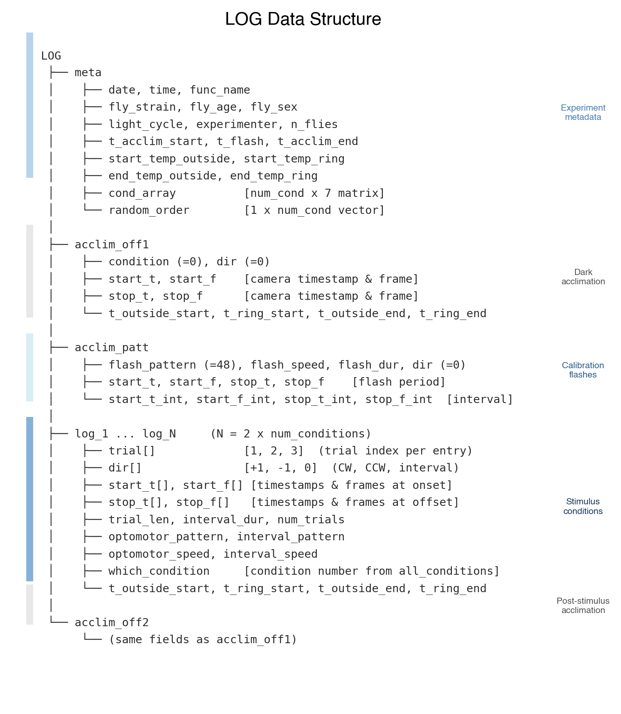{#fig-log width=100%}

\newpage

**Build sequence:**

1. `initialize_video_and_folders` creates `LOG.meta` with date, time, strain, age, sex, etc.
2. `present_acclim_off(LOG, ..., 1, d)` adds `LOG.acclim_off1`
3. The protocol script adds `LOG.acclim_patt` (calibration flashes)
4. The condition loop adds `LOG.log_1`, `LOG.log_2`, ... `LOG.log_N` (where N = 2 x num_conditions, covering both repetitions)
5. `present_acclim_off(LOG, ..., 2, d)` adds `LOG.acclim_off2`
6. The protocol script appends final fields to `LOG.meta`: timing parameters, start/end temperatures, `cond_array`, `random_order`
7. The LOG is saved as `LOG_{date}_{time}.mat`


## LOG.meta Fields

| Field | Type | Description |
|:------|:---|:--------------|
| `date` | datetime | Experiment date (yyyy_MM_dd) |
| `time` | datetime | Experiment start time |
| `func_name` | string | Protocol name (e.g., "protocol_27") |
| `fly_strain` | string | Genotype of the flies |
| `fly_age` | string | Age in days |
| `fly_sex` | string | "F" or "M" |
| `light_cycle` | string | Light/dark cycle timing |
| `experimenter` | string | Person running the experiment |
| `n_flies` | string | Number of flies in the arena |
| `t_acclim_start` | double | Duration of pre-stimulus acclimation (seconds) |
| `t_flash` | double | Duration of calibration flashes (seconds) |
| `t_acclim_end` | double | Duration of post-stimulus acclimation (seconds) |
| `start_temp_outside` | double | Ambient temperature at experiment start |
| `start_temp_ring` | double | Arena ring temperature at experiment start |
| `end_temp_outside` | double | Ambient temperature at experiment end |
| `end_temp_ring` | double | Arena ring temperature at experiment end |
| `cond_array` | matrix | The full `all_conditions` matrix [N x 7] |
| `random_order` | vector | Randomized condition presentation order |


## LOG.acclim_off1 and LOG.acclim_off2 Fields

| Field | Type | Description |
|:------|:-----|:------------|
| `condition` | double | Always 0 (darkness) |
| `dir` | double | Always 0 (no direction) |
| `start_t` | double | Camera timestamp at acclimation start |
| `start_f` | double | Camera frame count at acclimation start |
| `stop_t` | double | Camera timestamp at acclimation end |
| `stop_f` | double | Camera frame count at acclimation end |
| `t_outside_start` | double | Ambient temperature at start |
| `t_ring_start` | double | Ring temperature at start |
| `t_outside_end` | double | Ambient temperature at end |
| `t_ring_end` | double | Ring temperature at end |

## LOG.acclim_patt Fields

| Field | Type | Description |
|:------|:-----|:------------|
| `flash_pattern` | double | Pattern 48 (full-field flash) |
| `flash_speed` | double | Flash animation speed |
| `flash_dur` | double | Flash duration in seconds |
| `dir` | double | Always 0 |
| `start_t`, `start_f` | double | Camera timing at flash start |
| `stop_t`, `stop_f` | double | Camera timing at flash end |
| `start_t_int`, `start_f_int` | double | Camera timing at interval start |
| `stop_t_int`, `stop_f_int` | double | Camera timing at interval end |

## LOG.log_N Fields (Stimulus Conditions)

Each `LOG.log_1` through `LOG.log_N` contains:

| Field | Type | Description |
|:------|:-----|:------------|
| `trial` | array | Trial indices [1, 2, 3] |
| `dir` | array | Directions [+1, -1, 0] (CW, CCW, interval) |
| `start_t` | array | Camera timestamps at each trial/interval onset |
| `start_f` | array | Camera frame counts at each trial/interval onset |
| `stop_t` | array | Camera timestamps at each trial/interval offset |
| `stop_f` | array | Camera frame counts at each trial/interval offset |
| `trial_len` | double | Trial duration in seconds |
| `interval_dur` | double | Interval duration in seconds |
| `num_trials` | double | Number of stimulus trials (usually 2) |
| `optomotor_pattern` | double | Pattern ID used for stimulus |
| `interval_pattern` | double | Pattern ID for interval (usually 47) |
| `optomotor_speed` | double | Stimulus speed (0--127) |
| `interval_speed` | double | Interval speed (usually 0 or 1) |
| `which_condition` | double | Condition number from `all_conditions` |
| `t_outside_start` | double | Ambient temperature at start |
| `t_ring_start` | double | Ring temperature at start |
| `t_outside_end` | double | Ambient temperature at end |
| `t_ring_end` | double | Ring temperature at end |

**Important:** For the standard `present_optomotor_stimulus`, the arrays have 3 entries (trial 1, trial 2, interval). For `_w_interval` variants, arrays alternate: stimulus, interval, stimulus, interval, ...

## Frame Synchronization

The critical link between stimulus events and behavioral data is the **frame count**. Each time a stimulus starts or stops, the protocol records the camera's current frame number. This allows precise alignment during offline analysis.

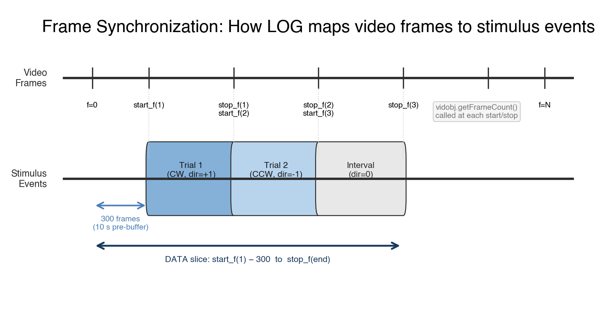{#fig-framesync width=100%}

**Key points:**

- `start_f = vidobj.getFrameCount().value` is called **immediately after** `Panel_com('start')` -- this is the frame when the stimulus becomes visible
- `stop_f = vidobj.getFrameCount().value` is called **immediately after** `Panel_com('stop')` -- this is the frame when the stimulus disappears
- At 30 fps, each frame is ~33.3 ms
- During processing, a **300-frame (10-second) pre-buffer** is included before each condition to capture baseline behavior before stimulus onset


\newpage

# Data Processing Pipeline {#sec-processing}

::: {.callout-note appearance="default" icon=false}
## **At a Glance**

- `process_freely_walking_data` iterates through all experiments for a given date
- `process_data_features` handles one experiment: loads tracking, computes metrics, saves results
- `combine_data_one_cohort` is the core function: filters bad tracking, computes 12 behavioral metrics
- `comb_data_one_cohort_cond` slices continuous data into per-condition segments using LOG frame indices
- `comb_data_across_cohorts_cond` merges all experiments for group-level analysis
:::

## \colorbox{fnbg}{\texttt{process\_freely\_walking\_data.m}} -- The Orchestrator \label{fn:process_freely_walking_data}

This is the main entry point for processing all experiments from a given date. It is called automatically by `daily_processing.py` when the automated pipeline (@sec-automation) is active, or can be invoked manually from the MATLAB command line.

**Usage:**

```matlab
process_freely_walking_data("2024_09_24")
process_freely_walking_data("2024_09_24", true)  % with stimulus videos
```

**How it works:**

1. Sets the project root and data paths
2. Navigates to the date folder in `DATA/01_tracked/{date}/`
3. Iterates through all protocol folders (`protocol_*`)
4. For each protocol, iterates through strain folders
5. For each strain, iterates through sex folders (F/M)
6. Calls `process_data_features()` for each combination

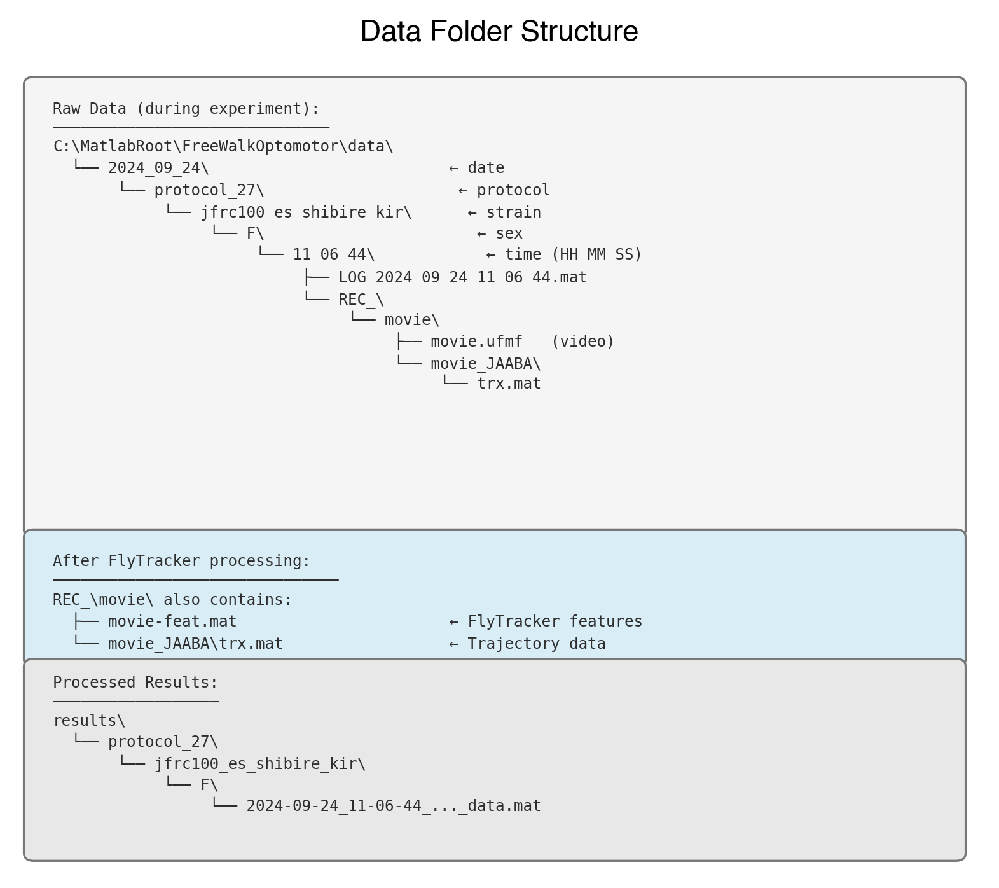{#fig-folders width=100%}


## \colorbox{fnbg}{\texttt{process\_data\_features.m}} -- Single Experiment Processing \label{fn:process_data_features}

Processes a single experiment: loads tracking data, computes metrics, generates overview plots, and saves results.

**Step-by-step:**

1. **Load LOG** -- Finds `LOG_*.mat` in the experiment folder
2. **Load FlyTracker output** -- Navigates into `REC_*/movie/` and loads:
   - `feat` from `movie-feat.mat` (behavioral features)
   - `trx` from `movie_JAABA/trx.mat` (trajectory data)
3. **Compute behavioral metrics** -- Calls `combine_data_one_cohort(feat, trx)` to produce `comb_data`
4. **Split by condition** -- Calls `comb_data_one_cohort_cond(LOG, comb_data, protocol)` to produce a per-condition DATA struct
5. **Generate overview plots** -- Histograms of locomotor parameters, full-experiment feature timeseries, and per-condition timeseries for forward velocity, angular velocity, turning rate, and distance from center
6. **Save** -- Writes `{date}_{time}_{strain}_{protocol}_{sex}_data.mat` containing: `LOG`, `feat`, `trx`, `comb_data`, `n_fly_data`


## \colorbox{fnbg}{\texttt{combine\_data\_one\_cohort.m}} -- Core Feature Extraction \label{fn:combine_data_one_cohort}

This is the most important processing function. It takes raw FlyTracker output and computes all derived behavioral metrics.

**Inputs:** `feat` (FlyTracker features struct), `trx` (trajectory struct)

**Outputs:** `comb_data` (struct with 12 metric matrices), modified `feat` and `trx` (bad flies removed)

### Step 1: Remove Bad Tracking (\colorbox{fnbg}{\texttt{check\_tracking\_FlyTrk}}) \label{fn:check_tracking_FlyTrk}

FlyTracker sometimes produces artifacts: a single fly split into two tracks, or a non-fly object (dust, shadow) tracked. The function `check_tracking_FlyTrk` detects these:

1. Extract the frame count for each fly: `d = [trx.nframes]`
2. Compute the mode (most common frame count) -- this is the true video length
3. Any fly whose frame count differs from the mode is flagged for removal
4. Flagged flies are removed from both `trx` and `feat.data`

This is a simple but effective quality control step.

### Step 2: High-Velocity Filtering

For each fly, frames where the FlyTracker-reported velocity exceeds 50 mm/s are marked as tracking errors. At these frames, position (`x`, `y`), heading, and distance-to-wall data are set to NaN for interpolation.

50 mm/s is well above the typical maximum walking speed of *Drosophila* (~30 mm/s) and reliably catches tracking jumps.

### Step 3: Interpolation

Missing values (from filtering) are filled using method-appropriate interpolation:

| Data | Method | Reason |
|:-----|:---|:------------|
| `d_wall_data` | Spline | Smooth, continuous changes in distance |
| `heading_data` | Previous value | Avoids introducing artificial heading jumps |
| `x_data`, `y_data` | Spline | Smooth position trajectories |

### Step 4: Distance from Center

```matlab
dist_data = 120 - d_wall_data;
```

FlyTracker reports `d_wall` (distance from fly to arena wall). The arena radius is 120 mm, so distance from center is simply `120 - d_wall`.

### Step 5: Angular Velocity (\colorbox{fnbg}{\texttt{vel\_estimate}}) \label{fn:vel_estimate}

Angular velocity measures how fast the fly is turning, in degrees per second.

**Method:** Least-squares line fit to heading data in a sliding window.

```matlab
av_data_rad = vel_estimate(heading, samp_rate, 'line_fit', t_window, []);
av_data = rad2deg(av_data_rad);
```

**Parameters:**

- `samp_rate = 1/30` (30 fps)
- `t_window = 16` -- the sliding window is 16 frames (~0.53 seconds)
- The `vel_estimate` function unwraps heading internally, fits a line in the window, and returns the slope as angular velocity

Larger `t_window` values produce smoother angular velocity estimates.

### Step 6: Forward Velocity (\colorbox{fnbg}{\texttt{gaussian\_conv}}) \label{fn:gaussian_conv}

Forward velocity measures the speed of the fly **in the direction it is heading**, in mm/s.

**Computation:**

1. Smooth x and y positions with Gaussian convolution
2. Compute frame-to-frame displacements: `dx = diff(x)`, `dy = diff(y)`
3. Convert to velocities: `vx = dx / dt`, `vy = dy / dt`
4. **Project onto heading direction:**

```matlab
fv = vx .* cos(heading) + vy .* sin(heading);
```

5. **Filter:** Negative values set to NaN (fly moving backwards = tracking artifact). Values > 50 mm/s set to NaN.
6. Fill NaNs with linear interpolation
7. Prepend `fv(1)` to maintain array length (since `diff` reduces length by 1)

### Step 7: Three-Point Velocity (\colorbox{fnbg}{\texttt{calculate\_three\_point\_velocity}}) \label{fn:calculate_three_point_velocity}

Speed magnitude regardless of heading direction, computed using central differences:

```matlab
% Forward difference at first point:
vx(1) = (x(2) - x(1)) / dt;

% Central difference for intermediate points:
vx(2:n-1) = (x(3:n) - x(1:n-2)) / (2 * dt);

% Backward difference at last point:
vx(n) = (x(n) - x(n-1)) / dt;

v = sqrt(vx.^2 + vy.^2);
```

This gives the speed (always positive) without regard to heading direction. Central difference is more accurate than simple forward difference.

### Step 8: Turning Rate (Curvature)

Turning rate combines angular and forward velocity:

```matlab
curv_data = av_data ./ fv_data;  % deg/mm
```

**Filtering:**

- Frames where `abs(fv_data) < 0.1` mm/s are set to NaN (turning rate is undefined when the fly is barely moving)
- Infinite values are set to NaN

Units are degrees per millimeter: how many degrees the fly turns for each millimeter it walks.

### Step 9: Viewing Distance (\colorbox{fnbg}{\texttt{calculate\_viewing\_distance}}) \label{fn:calculate_viewing_distance}

The distance from the fly to the arena wall **in the direction it is heading**. This tells us how far ahead the fly can "see" before the wall.

**Algorithm:** Solves the ray-circle intersection equation.

Given a fly at position $(x_f, y_f)$ heading in direction $\theta$, and a circular arena centered at $(x_c, y_c)$ with radius $R$:

The ray is parameterized as:

$$x(t) = x_f + t\cos\theta, \quad y(t) = y_f + t\sin\theta$$

Substituting into the circle equation $(x - x_c)^2 + (y - y_c)^2 = R^2$ gives a quadratic in $t$:

$$At^2 + Bt + C = 0$$

where $A = 1$, $B = 2[(x_f - x_c)\cos\theta + (y_f - y_c)\sin\theta]$, $C = (x_f - x_c)^2 + (y_f - y_c)^2 - R^2$.

The viewing distance is the smallest positive root.

**Arena parameters (hardcoded):**

- PPM (pixels per mm) = 4.1691
- Center of arena = (528, 520) pixels = (126.6, 124.7) mm
- Arena radius = 496 pixels = 119.0 mm

### Step 10: Inter-Fly Distance and Angle (\colorbox{fnbg}{\texttt{calculate\_distance\_to\_nearest\_fly}}) \label{fn:calculate_distance_to_nearest_fly}

For each fly at each frame:

- **IFD_data** (inter-fly distance): Euclidean distance to the nearest other fly, in mm
- **IFA_data** (inter-fly angle): Angle to the nearest other fly relative to the focal fly's heading, in degrees

### Output: `comb_data` Struct

All metrics are stored as `[n_flies x n_frames]` matrices:

| Field | Description | Units |
|:------|:------------|:------|
| `vel_data` | Three-point velocity | mm/s |
| `fv_data` | Forward velocity | mm/s |
| `av_data` | Angular velocity | deg/s |
| `curv_data` | Turning rate | deg/mm |
| `dist_data` | Distance from center | mm |
| `heading_data` | Unwrapped heading | deg |
| `heading_wrap` | Wrapped heading | deg |
| `x_data` | X position | mm |
| `y_data` | Y position | mm |
| `view_dist` | Viewing distance to wall | mm |
| `IFD_data` | Inter-fly distance | mm |
| `IFA_data` | Inter-fly angle | deg |


## \colorbox{fnbg}{\texttt{comb\_data\_one\_cohort\_cond.m}} -- Splitting by Condition \label{fn:comb_data_one_cohort_cond}

This function takes the continuous `comb_data` matrices and slices them into per-condition segments using the LOG's frame indices.

**How it works:**

1. Find all LOG fields starting with `log_` to determine the number of conditions
2. The first half of conditions belong to **Repetition 1**, the second half to **Repetition 2**
3. For each condition log:
   - Extract `which_condition` (the condition number from `all_conditions`)
   - Compute the data slice: `start_f(1) - 300` to `stop_f(end)`
   - The 300-frame (10-second) pre-buffer captures baseline behavior before stimulus onset
   - Store the slice as `DATA.(strain).(landing).(sex)(sz).R1_condition_N` or `R2_condition_N`
4. Also store acclimation phases: `acclim_off1`, `acclim_patt`, `acclim_off2`

**Condition matching:** For newer protocols (protocol_24, protocol_27), the condition number is stored directly in `Log.which_condition`. For older protocols, the function matches parameters against the protocol's condition array.


## \colorbox{fnbg}{\texttt{comb\_data\_across\_cohorts\_cond.m}} -- Merging Across Experiments \label{fn:comb_data_across_cohorts_cond}

Combines processed data from all experiments for a single protocol into one hierarchical DATA struct.

**How it works:**

1. Find all `*_data.mat` files in the protocol results directory
2. For each file, load `comb_data`, `LOG`, and `n_fly_data`
3. Extract strain and sex from `LOG.meta`
4. Append to the DATA struct, incrementing the cohort index
5. Process each condition using the same frame-slicing logic

This produces the final DATA struct used for group analysis.


# The DATA Struct {#sec-data}

::: {.callout-note appearance="default" icon=false}
## **At a Glance**

- DATA is the final output: a hierarchical struct organizing all experiments
- Levels: strain, sex, cohort (array index), condition, metric data
- Conditions are named `R1_condition_1`, `R2_condition_N`, etc., plus acclimation phases
- Each condition contains stimulus metadata and all 12 behavioral metric matrices
- All data matrices are `[n_flies x n_frames]`
:::

## Hierarchy

The DATA struct organizes all experimental data in a nested hierarchy:

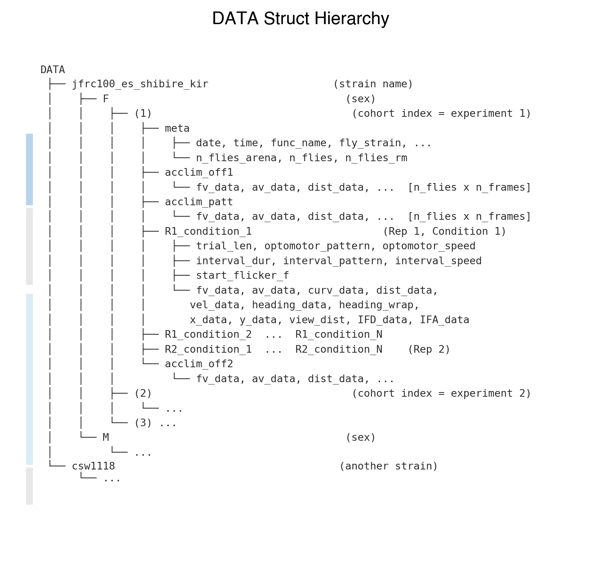{#fig-datastruct width=100%}

::: {.callout-note appearance="default" icon=false}
## **Example: Accessing DATA**

```matlab
% Forward velocity: strain, sex F, cohort 1, Rep 1 condition 1
fv = DATA.jfrc100_es_shibire_kir.F(1).R1_condition_1.fv_data;
%   fv is [n_flies x n_frames]
```
:::

**Levels:**

1. **Strain** -- e.g., `DATA.jfrc100_es_shibire_kir`, `DATA.csw1118`
2. **Sex** -- `DATA.(strain).F` or `DATA.(strain).M`
3. **Cohort index** -- Array index for each experimental session, e.g., `DATA.(strain).F(1)`, `DATA.(strain).F(2)`
4. **Condition** -- Named fields for each experimental phase
5. **Data arrays** -- `[n_flies x n_frames]` matrices of behavioral metrics

## Condition Names

| Name | Description |
|:-----|:------------|
| `meta` | Experiment metadata (same as LOG.meta + fly counts) |
| `acclim_off1` | Pre-stimulus dark acclimation (300s) |
| `acclim_patt` | Calibration flash period |
| `R1_condition_1` ... `R1_condition_N` | Repetition 1, conditions 1 through N |
| `R2_condition_1` ... `R2_condition_N` | Repetition 2, conditions 1 through N |
| `acclim_off2` | Post-stimulus dark acclimation (30s) |

Condition numbers match the `condition_n` column in the protocol's `all_conditions` matrix.

## Per-Condition Fields

Each condition contains stimulus metadata and all behavioral metrics:

**Stimulus metadata:** `trial_len`, `interval_dur`, `optomotor_pattern`, `optomotor_speed`, `interval_pattern`, `interval_speed`, `start_flicker_f`

**Behavioral data** (all `[n_flies x n_frames]`): `fv_data`, `av_data`, `curv_data`, `dist_data`, `vel_data`, `heading_data`, `heading_wrap`, `x_data`, `y_data`, `view_dist`, `IFD_data`, `IFA_data`

## Accessing Data -- Examples

```matlab
% Load combined data for protocol_27
protocol_dir = '/path/to/results/protocol_27';
DATA = comb_data_across_cohorts_cond( ...
    protocol_dir);

% Get forward velocity:
%   strain jfrc100, sex F, cohort 1, R1 cond 1
fv = DATA.jfrc100_es_shibire_kir ...
    .F(1).R1_condition_1.fv_data;
% fv is [n_flies x n_frames]

% Mean forward velocity across all flies
mean_fv = mean(fv, 1);  % [1 x n_frames]

% Get the stimulus parameters
speed = DATA.jfrc100_es_shibire_kir ...
    .F(1).R1_condition_1.optomotor_speed;
pattern = DATA.jfrc100_es_shibire_kir ...
    .F(1).R1_condition_1.optomotor_pattern;

% Number of cohorts for this strain/sex
n_cohorts = length( ...
    DATA.jfrc100_es_shibire_kir.F);

% List all strains in the dataset
strain_names = fieldnames(DATA);
```


\newpage

# Behavioral Metrics Reference {#sec-metrics}

::: {.callout-note appearance="default" icon=false}
## **At a Glance**

- 12 behavioral metrics are computed for each fly at each frame
- Forward velocity and angular velocity are the primary optomotor response measures
- All metrics are stored as `[n_flies x n_frames]` matrices in `comb_data` and `DATA`
- See the Quick Reference table (@sec-quickref) for a compact summary of all metrics
:::

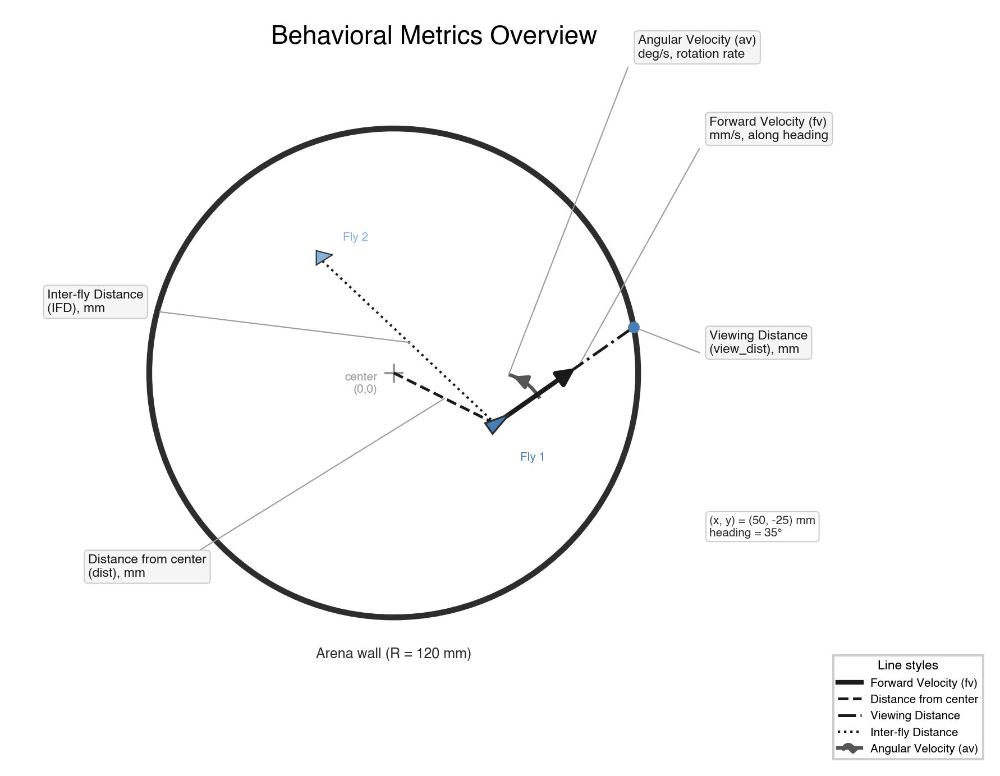{#fig-metrics width=100%}

## Forward Velocity (`fv_data`)

\begin{tabularx}{\textwidth}{>{\raggedright\arraybackslash}p{2.5cm} X}
\textbf{Property} & \textbf{Value} \\
\hline
\textbf{Units} & mm/s \\
\textbf{Range} & 0 -- \textasciitilde30 mm/s (typical walking) \\
\textbf{Meaning} & Speed in the direction the fly is heading \\
\end{tabularx}

**Computation:** Projection of the velocity vector onto the heading direction: `fv = vx * cos(theta) + vy * sin(theta)`. Position is Gaussian-smoothed before differentiation. Negative values and values > 50 mm/s are filtered as artifacts.

**Interpretation:** A stationary fly has fv near 0. Active walking is typically 5--20 mm/s.

## Angular Velocity (`av_data`)

\begin{tabularx}{\textwidth}{>{\raggedright\arraybackslash}p{2.5cm} X}
\textbf{Property} & \textbf{Value} \\
\hline
\textbf{Units} & deg/s \\
\textbf{Range} & approximately $-500$ to $+500$ deg/s \\
\textbf{Meaning} & Rate of heading change (turning speed) \\
\end{tabularx}

**Computation:** Least-squares line fit to heading data in a 16-frame sliding window. Positive values indicate counterclockwise turns; negative values indicate clockwise turns.

**Interpretation:** In the optomotor response, flies turn in the direction of stimulus motion. A positive mean angular velocity during a CW stimulus indicates the fly is following the pattern.

## Turning Rate (`curv_data`)

\begin{tabularx}{\textwidth}{>{\raggedright\arraybackslash}p{2.5cm} X}
\textbf{Property} & \textbf{Value} \\
\hline
\textbf{Units} & deg/mm \\
\textbf{Range} & Variable \\
\textbf{Meaning} & Path curvature -- how sharply the fly turns per unit distance \\
\end{tabularx}

**Computation:** `curv = av_data / fv_data`. Undefined (NaN) when forward velocity < 0.1 mm/s.

**Interpretation:** High absolute values indicate sharp turns; near-zero values indicate straight walking. This metric normalizes turning by walking speed.

## Distance from Center (`dist_data`)

\begin{tabularx}{\textwidth}{>{\raggedright\arraybackslash}p{2.5cm} X}
\textbf{Property} & \textbf{Value} \\
\hline
\textbf{Units} & mm \\
\textbf{Range} & 0 -- 120 mm \\
\textbf{Meaning} & Distance from the fly to the arena center \\
\end{tabularx}

**Computation:** `dist = 120 - d_wall`, where `d_wall` is FlyTracker's distance-to-wall output and 120 mm is the arena radius.

**Interpretation:** Flies near the center have low dist values; flies near the wall have values approaching 120 mm. Freely-walking flies often exhibit thigmotaxis (preference for walking near the wall).

## Three-Point Velocity (`vel_data`)

\begin{tabularx}{\textwidth}{>{\raggedright\arraybackslash}p{2.5cm} X}
\textbf{Property} & \textbf{Value} \\
\hline
\textbf{Units} & mm/s \\
\textbf{Range} & 0 -- \textasciitilde50 mm/s \\
\textbf{Meaning} & Overall speed regardless of heading direction \\
\end{tabularx}

**Computation:** Central-difference approximation of speed from x,y positions. Always positive (magnitude, not direction).

**Interpretation:** Unlike forward velocity, this captures all motion including sideways movements. Useful as a general activity measure.

## Viewing Distance (`view_dist`)

\begin{tabularx}{\textwidth}{>{\raggedright\arraybackslash}p{2.5cm} X}
\textbf{Property} & \textbf{Value} \\
\hline
\textbf{Units} & mm \\
\textbf{Range} & 0 -- \textasciitilde240 mm (diameter) \\
\textbf{Meaning} & Distance from fly to arena wall in the heading direction \\
\end{tabularx}

**Computation:** Ray-circle intersection from the fly's position along its heading vector to the arena wall.

**Interpretation:** A fly facing the nearby wall has a short viewing distance; a fly in the center facing across the arena has a large viewing distance. This metric is important for understanding how the visual environment varies with position and orientation.

## Inter-Fly Distance (`IFD_data`)

\begin{tabularx}{\textwidth}{>{\raggedright\arraybackslash}p{2.5cm} X}
\textbf{Property} & \textbf{Value} \\
\hline
\textbf{Units} & mm \\
\textbf{Meaning} & Distance to the nearest other fly \\
\end{tabularx}

**Interpretation:** Low values indicate flies are close together; useful for studying social interactions or grouping behavior.

## Inter-Fly Angle (`IFA_data`)

\begin{tabularx}{\textwidth}{>{\raggedright\arraybackslash}p{2.5cm} X}
\textbf{Property} & \textbf{Value} \\
\hline
\textbf{Units} & deg \\
\textbf{Meaning} & Angle to the nearest fly, relative to the focal fly's heading \\
\end{tabularx}

**Interpretation:** 0 degrees means the nearest fly is directly ahead; 180 degrees means it is directly behind.

## Position and Heading

- **`x_data`**, **`y_data`**: Position in mm, relative to the arena center
- **`heading_data`**: Unwrapped heading in degrees (continuous, can exceed 360)
- **`heading_wrap`**: Wrapped heading in degrees (-180 to +180)

These are the raw tracking outputs (after filtering and interpolation) that all other metrics are derived from.

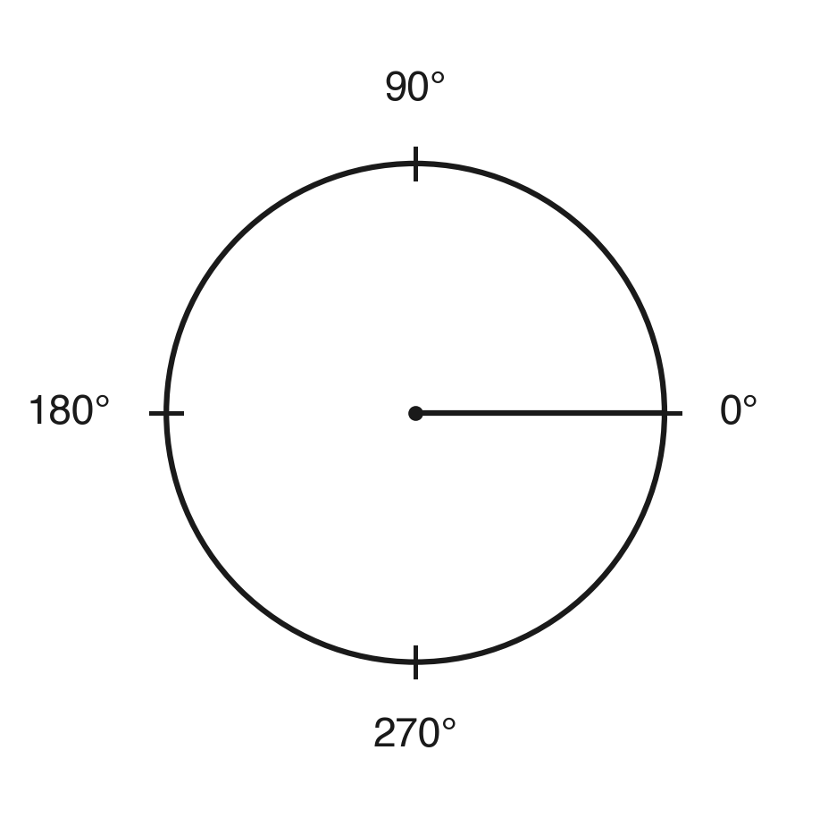{#fig-heading width=40%}

\newpage

# Visualization and Plotting Functions {#sec-plotting}

::: {.callout-note appearance="default" icon=false}
## **At a Glance**

- `make_overview` generates summary histograms of locomotor parameters
- `plot_all_features_filt` and `plot_all_features_acclim` plot full-experiment timeseries
- `plot_allcond_onecohort_tuning` creates per-condition comparison plots
- `plot_allcond_acrossgroups_tuning` overlays strain vs control responses across conditions
- `make_summary_heat_maps_p27` generates p-value heatmaps for screening results
- `plot_xcond_per_strain2` and `plot_boxchart_metrics_xcond` compare responses across conditions
- `plot_xstrain_per_cond` and `plot_boxchart_metrics_xstrains` compare responses across strains
- `plot_fly_occupancy_heatmaps_all` generates spatial occupancy maps
- `plot_traj_xcond`, `plot_traj_xflies`, and `plot_traj_pre_post` visualize fly trajectories
:::

## \colorbox{fnbg}{\texttt{make\_overview.m}} \label{fn:make_overview}

Generates a summary overview figure with histograms of key locomotor parameters for quality checking a single experiment. Called by `process_data_features`.

{#fig-ex-overview width=55%}

## \colorbox{fnbg}{\texttt{plot\_all\_features\_filt.m}} \label{fn:plot_all_features_filt}

Plots timeseries of all behavioral features for the full experiment duration (after filtering). Shows forward velocity, angular velocity, turning rate, and distance from center as stacked panels. Called by `process_data_features`.

{#fig-ex-timeseries width=100%}

## \colorbox{fnbg}{\texttt{plot\_all\_features\_acclim.m}} \label{fn:plot_all_features_acclim}

Similar to `plot_all_features_filt` but focused on the acclimation periods only. Useful for verifying baseline behavior before stimulus onset.

{#fig-ex-acclim width=75%}

## \colorbox{fnbg}{\texttt{plot\_allcond\_onecohort\_tuning.m}} \label{fn:plot_allcond_onecohort_tuning}

Creates per-condition comparison plots for a single cohort. Shows stimulus-evoked responses side by side across conditions, making it easy to compare the optomotor response at different speeds or spatial frequencies.

{#fig-ex-percond width=75%}

## Across-Cohorts Visualization {#sec-across-cohorts-viz}

Once data from multiple experiments has been combined using `comb_data_across_cohorts_cond`, two main visualization approaches are available for comparing experimental strains against the empty-split control.

### \colorbox{fnbg}{\texttt{plot\_allcond\_acrossgroups\_tuning.m}} \label{fn:plot_allcond_acrossgroups_tuning}

Overlays the mean $\pm$ SEM timeseries of two or more experimental groups on the same axes for each stimulus condition. Typically used to compare a target strain (purple) against the empty-split control (grey). Called by `process_screen_data`.

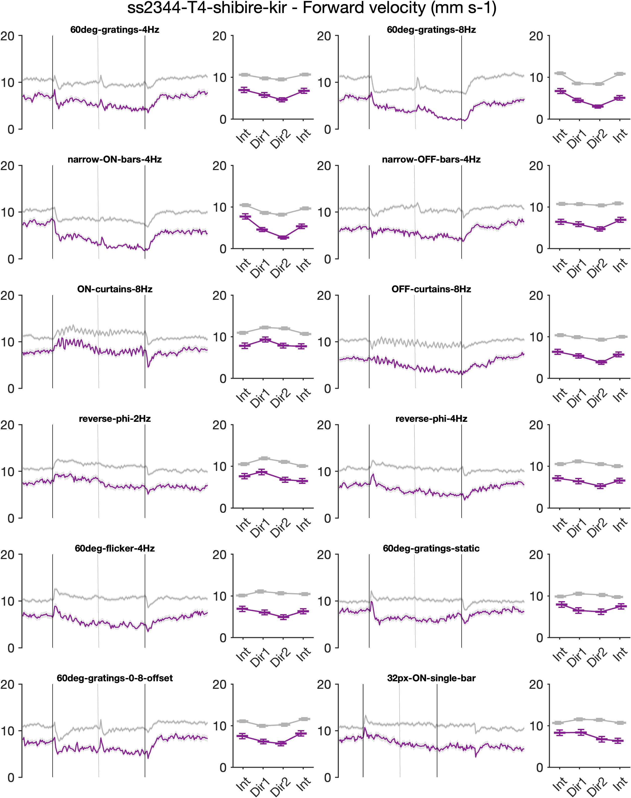{#fig-ex-strainvses width=80%}

### \colorbox{fnbg}{\texttt{make\_summary\_heat\_maps\_p27.m}} \label{fn:make_summary_heat_maps_p27}

Generates a p-value heatmap summarizing statistical comparisons of all screened strains against the empty-split control for a given condition. Red cells indicate the target strain has a higher metric value than the control; blue cells indicate lower. Color intensity reflects statistical significance after FDR correction ($\alpha = 0.001$). Calls `make_pvalue_heatmap_across_strains` and `fdr_bh` internally.

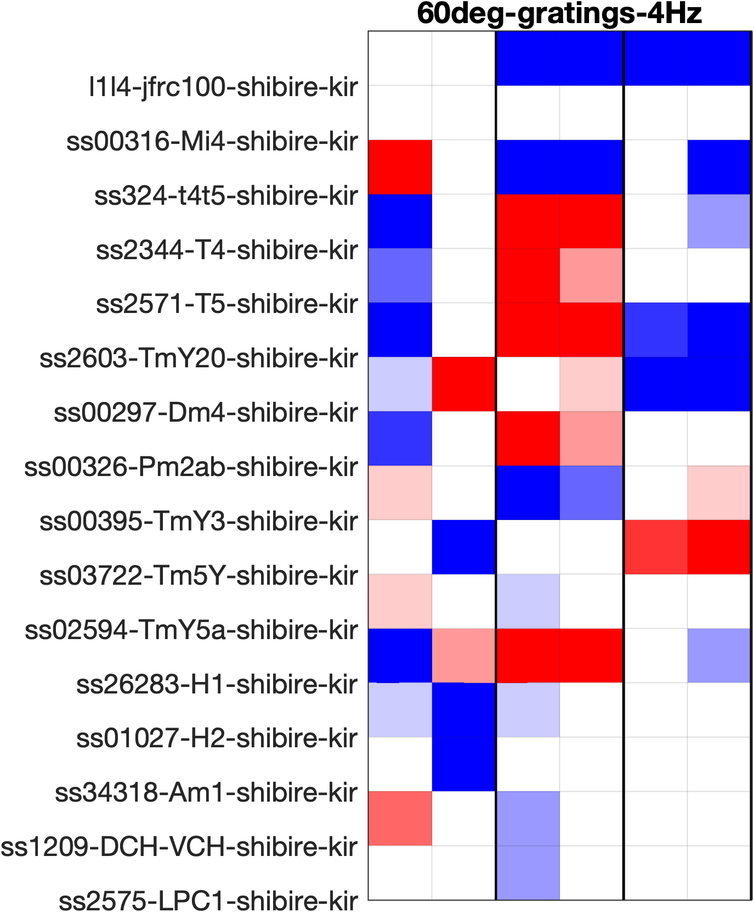{#fig-ex-heatmap width=45%}


\newpage

# Analysis and Figure Scripts {#sec-analysis-scripts}

::: {.callout-note appearance="default" icon=false}
## **At a Glance**

- Three standalone scripts generate publication-quality figures from the DATA struct
- `fig_different_speeds.m` compares locomotor responses across stimulus speeds (protocol\_31)
- `fig1_plots.m` produces the full set of figures for the MIC paper (protocol\_27): time series, box plots, occupancy maps, trajectories, and cross-strain comparisons
- `generate_trajectory_plots.m` visualizes individual fly movement paths in the arena
- All scripts load data via `comb_data_across_cohorts_cond` and use the same underlying plotting functions
:::

These scripts are located in `plotting_functions/figures/` and `analysis_scripts/` and serve as worked examples of how to use the plotting functions described in @sec-plotting with the DATA struct described in @sec-data. They are not part of the automated pipeline; instead, they are run interactively to explore results and generate figures for presentations or publications.

## \colorbox{fnbg}{\texttt{fig\_different\_speeds.m}} \label{fn:fig_different_speeds}

**Location:** `plotting_functions/figures/fig_different_speeds.m`

Compares locomotor responses across different stimulus speeds within a single spatial frequency. Designed for **protocol\_31**, which contains 10 conditions: 60-degree gratings at 1, 2, 4, and 8 Hz; 15-degree gratings at 4, 8, 16, and 32 Hz; and corresponding flicker controls for each spatial frequency.

**What it does:**

1. Loads the protocol\_31 DATA struct using `comb_data_across_cohorts_cond`
2. Plots time series of a chosen metric across speed conditions using `plot_xcond_per_strain2` --- each condition is a different color on the same axes, making it easy to see how response magnitude scales with temporal frequency
3. Generates box-and-whisker summary plots using `plot_boxchart_metrics_xcond`, comparing the distribution of a metric across speeds

**Key parameters:**

- `cond_ids` --- which speed conditions to compare (e.g., `[1,2,3,4]` for all 60-degree speeds)
- `data_type` --- which metric to plot (`dist_data_delta`, `av_data`, etc.)
- `rng` --- frame range for box plot averaging (e.g., `1170:1200` for the last second of stimulus)
- `delta` --- reference point for the metric (0 = absolute, 1 = relative to stimulus onset, 2 = relative to stimulus offset)

{#fig-ex-speed-ts width=70%}

{#fig-ex-speed-box width=40%}


## \colorbox{fnbg}{\texttt{fig1\_plots.m}} \label{fn:fig1_plots}

**Location:** `plotting_functions/figures/fig1_plots.m`

The most comprehensive figure-generation script, producing the full set of publication figures for the MIC paper using **protocol\_27** data. This script demonstrates all major analysis approaches: single-strain time series, cross-condition box plots, spatial occupancy heatmaps, trajectory visualizations, and multi-strain comparisons.

**What it does:**

1. Loads protocol\_27 DATA struct and generates experiment summary metadata
2. **Time series** (`plot_xcond_per_strain2`): plots behavioral metrics across selected conditions for a single strain (typically the empty-split control), with optional SEM/SD error bands and shaded metric-calculation regions
3. **Box plots** (`plot_boxchart_metrics_xcond`): compares metric distributions across conditions. Multiple frame ranges and delta modes are used --- e.g., distance at stimulus end ($\Delta$ from start), forward velocity during the full stimulus period
4. **Occupancy heatmaps** (`plot_fly_occupancy_heatmaps`, `plot_fly_occupancy_heatmaps_all`): 2D spatial histograms showing where flies spend time during stimulus conditions, with arena circle overlay and probability centroid markers
5. **Trajectories** (`plot_traj_xcond`, `plot_traj_xflies`): individual fly movement paths in the arena, comparing either one fly across multiple conditions or multiple flies within one condition
6. **Cross-strain comparison** (`plot_xstrain_per_cond`, `plot_boxchart_metrics_xstrains`): overlays time series or box plots for multiple strains on the same axes, using a per-strain color scheme

**Key functions introduced:**

### \colorbox{fnbg}{\texttt{plot\_xcond\_per\_strain2.m}} \label{fn:plot_xcond_per_strain2}

Plots timeseries of a behavioral metric for a single strain, with each condition rendered in a different color on the same axes. Useful for comparing how a fly genotype responds to different stimuli.

```matlab
plot_xcond_per_strain2(protocol, data_type, ...
    cond_ids, strain_names, params, DATA)
```

The `params` struct controls the plot: `plot_sem` and `plot_sd` toggle error bands, `shaded_areas` highlights the frame ranges used for box plot metrics, and `plot_individ` shows individual fly traces.

{#fig-ex-xcond-ts width=70%}

### \colorbox{fnbg}{\texttt{plot\_boxchart\_metrics\_xcond.m}} \label{fn:plot_boxchart_metrics_xcond}

Generates box-and-whisker plots with individual data points, comparing the distribution of a behavioral metric across stimulus conditions. Each condition is a colored box; individual flies are shown as jittered circles.

```matlab
plot_boxchart_metrics_xcond(DATA, cond_ids, ...
    strain_names, data_type, rng, delta)
```

The `rng` parameter specifies which frames to average (e.g., `300:1200` for the full stimulus, `1170:1200` for the last second). The `delta` parameter controls the reference point: 0 = raw values, 1 = relative to frame 300 (stimulus onset), 2 = relative to frame 1200 (stimulus offset).

{#fig-ex-xcond-box width=40%}

### \colorbox{fnbg}{\texttt{plot\_fly\_occupancy\_heatmaps\_all.m}} \label{fn:plot_fly_occupancy_heatmaps_all}

Generates 2D spatial occupancy heatmaps showing where flies spend time during selected stimulus conditions, pooled across all cohorts. Produces a 3-panel figure (typically: 4 Hz gratings, static gratings, flicker) with arena circle overlay and probability centroid markers.

```matlab
hFig = plot_fly_occupancy_heatmaps_all(data, ...
    frameRange, nbins)
```

The function bins fly x/y positions into a 2D histogram, normalizes to probability, and displays with a consistent colormap. The arena boundary is drawn using the hardcoded calibration constants (`PPM = 4.1691`, center `[528, 516]`, radius `496` pixels).

{#fig-ex-occupancy width=100%}

### \colorbox{fnbg}{\texttt{plot\_xstrain\_per\_cond.m}} \label{fn:plot_xstrain_per_cond}

Plots timeseries of a behavioral metric for a single condition, with each strain rendered in a different color. The complement of `plot_xcond_per_strain2`; here strains vary while the condition is fixed.

```matlab
plot_xstrain_per_cond(protocol, data_type, ...
    cond_ids, strains_to_plot, params, DATA)
```

The `strains_to_plot` parameter is a vector of strain indices (positions in `fieldnames(DATA)`).

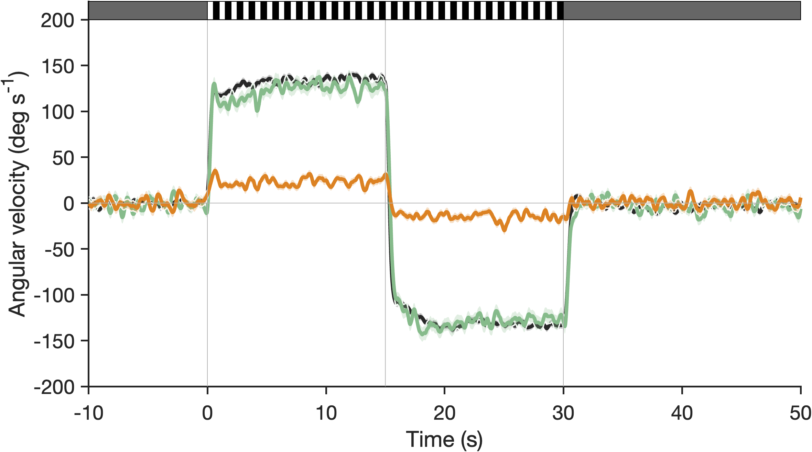{#fig-ex-xstrain-ts width=70%}

### \colorbox{fnbg}{\texttt{plot\_boxchart\_metrics\_xstrains.m}} \label{fn:plot_boxchart_metrics_xstrains}

Box-and-whisker plots comparing multiple strains for a single condition --- the cross-strain complement of `plot_boxchart_metrics_xcond`.

```matlab
plot_boxchart_metrics_xstrains(DATA, ...
    strain_ids, cond_idx, data_type, rng, delta)
```

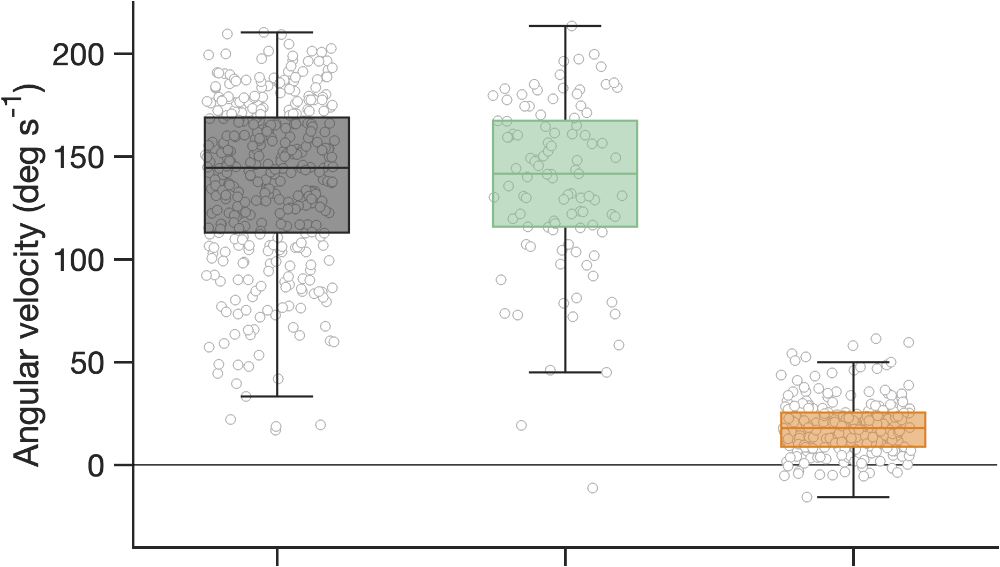{#fig-ex-xstrain-box width=45%}


## \colorbox{fnbg}{\texttt{generate\_trajectory\_plots.m}} \label{fn:generate_trajectory_plots}

**Location:** `analysis_scripts/generate_trajectory_plots.m`

Generates trajectory visualizations showing individual fly movement paths in the arena. Uses four complementary trajectory plotting functions that each show a different aspect of fly locomotion.

**What it does:**

1. Loads the DATA struct for a chosen protocol (default: protocol\_35)
2. Generates a subplot grid of all fly trajectories for one condition using `plot_traj_subplot`
3. Compares a single fly's trajectory across multiple conditions using `plot_traj_xcond`
4. Overlays multiple fly trajectories for the same condition using `plot_traj_xflies`
5. Visualizes pre-stimulus, stimulus, and post-stimulus trajectory segments using `plot_traj_pre_post`

All trajectory plots share a common coordinate system (arena center at approximately 123 mm, 125 mm) and plot the stimulus period (frames 300--1200, i.e., 30 seconds at 30 fps) by default.

**Key functions introduced:**

### \colorbox{fnbg}{\texttt{plot\_traj\_subplot.m}} \label{fn:plot_traj_subplot}

Generates a grid of subplots showing each fly's trajectory in the arena during the stimulus period for one condition. Up to 35 flies per figure; additional figures are created automatically if needed.

```matlab
plot_traj_subplot(DATA, strain, condition_n, ...
    save_folder)
```

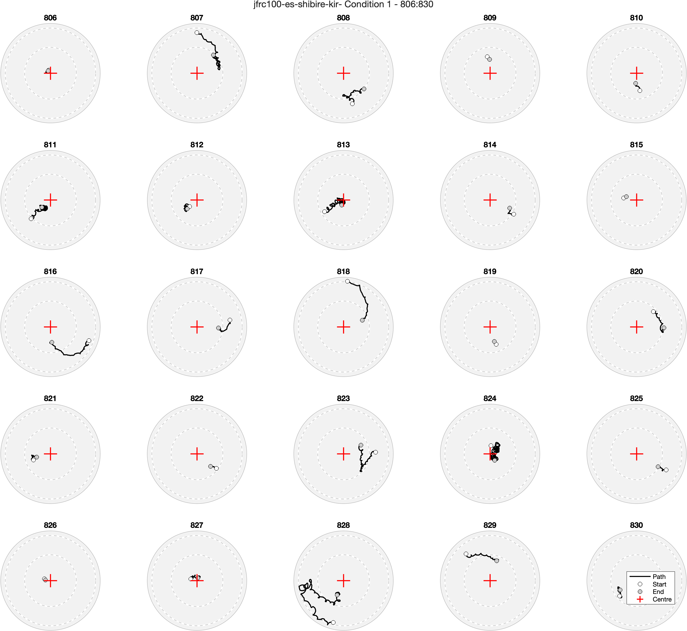{#fig-ex-traj-subplot width=90%}

### \colorbox{fnbg}{\texttt{plot\_traj\_xcond.m}} \label{fn:plot_traj_xcond}

Overlays a single fly's trajectory across multiple stimulus conditions on the same axes. Each condition is rendered in a different color, revealing how the fly's movement pattern changes between stimuli.

```matlab
plot_traj_xcond(DATA, strain, cond_ids, fly_idx)
```

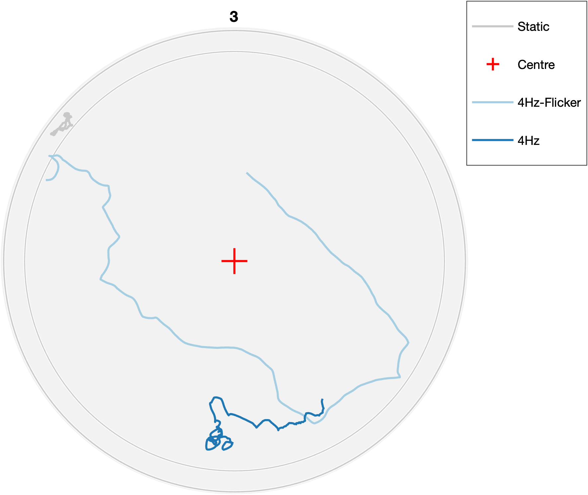{#fig-ex-traj-xcond width=50%}

### \colorbox{fnbg}{\texttt{plot\_traj\_xflies.m}} \label{fn:plot_traj_xflies}

Overlays trajectories from multiple flies for a single stimulus condition on the same axes. Useful for showing variability between individuals.

```matlab
plot_traj_xflies(DATA, strain, cond_idx, fly_ids)
```

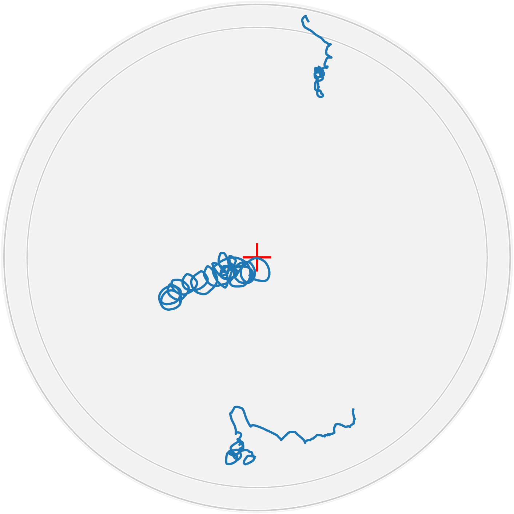{#fig-ex-traj-xflies width=50%}

### \colorbox{fnbg}{\texttt{plot\_traj\_pre\_post.m}} \label{fn:plot_traj_pre_post}

Visualizes trajectory segments before, during, and after stimulus onset for one or more flies. Pre-stimulus and post-stimulus segments (5 seconds each) are drawn in grey; the stimulus period is drawn in the condition color. This makes stimulus-evoked changes in locomotion visually obvious.

```matlab
plot_traj_pre_post(DATA, strain, cond_idx, ...
    fly_ids)
```

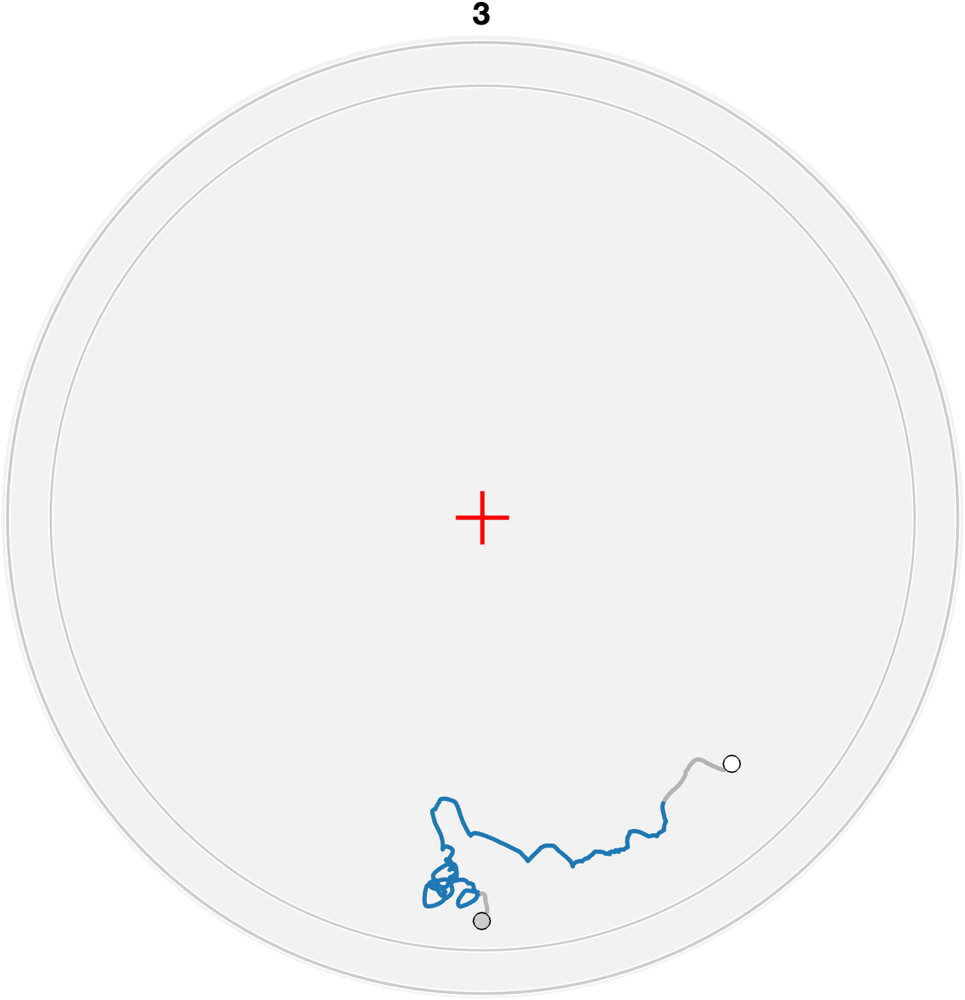{#fig-ex-traj-prepost width=50%}


\newpage

# Utility Functions {#sec-utilities}

## \colorbox{fnbg}{\texttt{check\_strain\_typos.m}} \label{fn:check_strain_typos}

Corrects common strain name typos that may have been entered through the metadata GUI. Maps misspelled variants to canonical strain names, ensuring consistent naming across the dataset.

## \colorbox{fnbg}{\texttt{generate\_circ\_stim\_ufmf.m}} \label{fn:generate_circ_stim_ufmf}

Generates a UFMF video of the LED stimulus pattern (circular projection) for documentation and verification purposes. Creates a video showing what the flies see from above.


\newpage

# Potential Pitfalls {#sec-pitfalls}

When adapting this pipeline to a new experimental setup, protocol, or fly strain, be aware of the following assumptions that are hardcoded in the current codebase. Each can cause silent errors if not addressed.

## Hardcoded Arena Parameters

`calculate_viewing_distance.m` contains hardcoded calibration constants:

```matlab
PPM = 4.1691;          % pixels per mm
CoA = [528, 520]/PPM;  % arena center in mm
R   = 496/PPM;         % arena radius in mm
```

These values are specific to the current camera and arena setup. If the camera, lens, or arena changes, these must be recalibrated. Incorrect values will silently corrupt all viewing distance and distance-from-center metrics.

**Source:** `processing_functions/functions/calculate_viewing_distance.m`, lines 39--43.

## Hardcoded Project Paths

`process_freely_walking_data.m` sets an absolute project root:

```matlab
PROJECT_ROOT = '\Users\burnettl\...';
```

This path must be updated for any other machine before running the processing pipeline.

**Source:** `processing_functions/process_freely_walking_data.m`, line 42.

## Protocol Condition Arrays Are Per-Protocol

`comb_data_one_cohort_cond.m` contains a large `if`/`elseif` block that maps each protocol name to its condition array. New protocols must either:

(a) Store conditions in `LOG.meta.cond_array` (as `protocol_24` and `protocol_27` already do --- this is the recommended approach), or

(b) Add a new `elseif` branch to this function.

If neither is done, condition matching will silently fail and produce incorrect results.

**Source:** `processing_functions/functions/comb_data_one_cohort_cond.m`, lines 3--126.

## Exactly 2 Repetitions Assumed

`comb_data_one_cohort_cond.m` splits the `log_` fields into the first half (Repetition 1) and second half (Repetition 2):

```matlab
if log_n < (n_cond/2) + 1
    rep_str = 'R1_condition_';
else
    rep_str = 'R2_condition_';
end
```

Running 3 or more repetitions, or only 1, will mislabel conditions. The code does not verify that the number of logged conditions equals exactly 2 times the number of unique conditions.

**Source:** `processing_functions/functions/comb_data_one_cohort_cond.m`, line 203.

## Velocity Threshold of 50 mm/s

`combine_data_one_cohort.m` flags frames where velocity exceeds 50 mm/s as tracking errors and sets them to NaN:

```matlab
vals_to_rm = abs(vel_data(k, :)) > 50;
```

This threshold is appropriate for *Drosophila melanogaster* but may need adjustment for larger or faster species. Real high-speed behaviour is indistinguishable from tracking errors at this threshold.

**Source:** `processing_functions/functions/combine_data_one_cohort.m`, lines 66 and 130.

## 300-Frame Pre-Buffer Is Hardcoded

`comb_data_one_cohort_cond.m` always includes 300 frames (10 seconds at 30 fps) before each condition onset:

```matlab
framesb4 = 300;
start_f = Log.start_f(1) - framesb4;
```

If a stimulus starts fewer than 300 frames after acclimation ends, this can produce out-of-bounds frame indices.

**Source:** `processing_functions/functions/comb_data_one_cohort_cond.m`, line 228.

## LOG Field Naming Is Fragile

Condition discovery searches for fields whose names start with `log_`:

```matlab
logfields = fields(startsWith(fields, 'log_'));
```

Any extra field added to the LOG struct with a name beginning with `log_` (e.g., `log_notes`, `log_metadata`) will be incorrectly treated as a stimulus condition.

**Source:** `processing_functions/functions/comb_data_one_cohort_cond.m`, line 195.

## Pattern-to-Description Mapping

`get_title_from_meta.m` uses a large switch statement to map pattern IDs to human-readable descriptions. New patterns require adding a manual entry. Additionally, some patterns have hidden speed multipliers --- patterns with 2-pixel animation steps (e.g., patterns 26, 27, 63) automatically double the nominal speed value, which is easy to overlook.

**Source:** `processing_functions/functions/get_title_from_meta.m`.

## Tracking QC Uses Statistical Mode

`check_tracking_FlyTrk.m` removes any fly whose frame count differs from the mode (most common frame count):

```matlab
d = [trx.nframes];
nframes_video = mode(d);
```

If a systematic tracking issue causes all flies to be off by one frame, no flies will be flagged. Conversely, if tracking splits are common, valid flies may be removed because their frame count differs from the mode.

**Source:** `processing_functions/functions/check_tracking_FlyTrk.m`.

## Strain Typos Pass Silently

`check_strain_typos.m` corrects only a predefined list of known typos. New misspellings are not caught and will create separate strain folders in the results directory, splitting data for the same genotype across multiple entries. Always verify strain names after data collection.

**Source:** `processing_functions/functions/check_strain_typos.m`.

## Move-Folder Nesting Bug in Daily Processing

In `daily_processing.py`, the `move_folder()` function uses `shutil.move(src, dst)`. If the destination folder already exists, `shutil.move` places the source folder *inside* the destination, creating a nested structure (e.g., `2_processed/2025_04_18/2025_04_18/...`). The function includes a warning comment but does not prevent this.

By contrast, `reprocessing_script.py`'s `move_folder()` deletes the destination first with `shutil.rmtree(dst)` before moving -- which avoids nesting but is destructive.

**Source:** `daily_processing/daily_processing.py`, lines 161--183; `daily_processing/reprocessing_script.py`, lines 105--119.

## No Retry Logic for Network File Operations

All automation scripts log network copy/move failures but do not retry them. A transient network outage during `shutil.copytree()` or `shutil.move()` will leave data in an intermediate state (partially copied, or stuck in the source directory). Manual intervention is required to re-run or complete the transfer.

**Source:** All three main automation scripts (`monitor_and_copy.py`, `monitor_and_track.py`, `daily_processing.py`).

## Duplicated Path Constants Across Automation Scripts

Each automation script defines its own copy of network and local path constants. There is no shared configuration file. If a path changes (e.g., the network share is moved), every script must be updated independently. Currently, `daily_processing.py` and `reprocessing_script.py` contain nearly identical path blocks.

**Source:** Path constants at the top of `monitor_and_copy.py`, `monitor_and_track.py`, `daily_processing.py`, and `reprocessing_script.py`.


\newpage

\appendix

# Function Index {#sec-index}

Alphabetical listing of all MATLAB functions referenced in this guide. Page numbers indicate the primary documentation location.

\begin{scriptsize}
\begin{tabularx}{\textwidth}{>{\raggedright\arraybackslash}p{5.5cm} c >{\raggedright\arraybackslash}X}
\textbf{Function} & \textbf{Page} & \textbf{Description} \\
\hline
\texttt{batch\_track\_ufmf} & \pageref{fn:batch_track_ufmf} & Batch FlyTracker processing for all videos in a folder \\
\texttt{calculate\_distance\_to\_\newline nearest\_fly} & \pageref{fn:calculate_distance_to_nearest_fly} & Compute IFD and IFA for each fly \\
\texttt{calculate\_three\_point\_velocity} & \pageref{fn:calculate_three_point_velocity} & Central-difference speed estimate \\
\texttt{calculate\_viewing\_distance} & \pageref{fn:calculate_viewing_distance} & Ray-circle intersection for viewing distance \\
\texttt{check\_strain\_typos} & \pageref{fn:check_strain_typos} & Correct common strain name misspellings \\
\texttt{check\_tracking\_FlyTrk} & \pageref{fn:check_tracking_FlyTrk} & QC: remove bad fly tracks by frame count \\
\texttt{comb\_data\_across\_cohorts\_cond} & \pageref{fn:comb_data_across_cohorts_cond} & Merge experiments into hierarchical DATA struct \\
\texttt{comb\_data\_one\_cohort\_cond} & \pageref{fn:comb_data_one_cohort_cond} & Split continuous data by condition using LOG \\
\texttt{combine\_data\_one\_cohort} & \pageref{fn:combine_data_one_cohort} & Core: compute 12 behavioral metrics \\
\texttt{export\_to\_google\_sheets} & \pageref{fn:export_to_google_sheets} & Push metadata to Google Sheet via HTTP \\
\texttt{fig\_different\_speeds} & \pageref{fn:fig_different_speeds} & Speed comparison analysis (protocol\_31) \\
\texttt{fig1\_plots} & \pageref{fn:fig1_plots} & Publication figures for MIC paper (protocol\_27) \\
\texttt{gaussian\_conv} & \pageref{fn:gaussian_conv} & Gaussian smoothing for position data \\
\texttt{generate\_circ\_stim\_ufmf} & \pageref{fn:generate_circ_stim_ufmf} & Generate stimulus video for documentation \\
\texttt{generate\_trajectory\_plots} & \pageref{fn:generate_trajectory_plots} & Trajectory visualization script \\
\texttt{get\_input\_parameters} & \pageref{fn:get_input_parameters} & GUI dialog for experiment metadata \\
\texttt{get\_temp\_rec} & \pageref{fn:get_temp_rec} & Read temperature from DAQ probes \\
\texttt{initialize\_temp\_recording} & \pageref{fn:initialize_temp_recording} & Configure DAQ for temperature monitoring \\
\texttt{initialize\_video\_and\_folders} & \pageref{fn:initialize_video_and_folders} & Camera setup, folder creation, LOG init \\
\texttt{make\_overview} & \pageref{fn:make_overview} & Summary histograms for QC \\
\texttt{make\_summary\_heat\_maps\_p27} & \pageref{fn:make_summary_heat_maps_p27} & P-value heatmap across strains \\
\texttt{plot\_all\_features\_acclim} & \pageref{fn:plot_all_features_acclim} & Acclimation period timeseries plots \\
\texttt{plot\_all\_features\_filt} & \pageref{fn:plot_all_features_filt} & Full-experiment timeseries plots \\
\texttt{plot\_allcond\_acrossgroups\_\newline tuning} & \pageref{fn:plot_allcond_acrossgroups_tuning} & Strain vs control timeseries overlay \\
\texttt{plot\_allcond\_onecohort\_tuning} & \pageref{fn:plot_allcond_onecohort_tuning} & Per-condition comparison plots \\
\texttt{plot\_boxchart\_metrics\_xcond} & \pageref{fn:plot_boxchart_metrics_xcond} & Box plots comparing conditions \\
\texttt{plot\_boxchart\_metrics\_xstrains} & \pageref{fn:plot_boxchart_metrics_xstrains} & Box plots comparing strains \\
\texttt{plot\_fly\_occupancy\_\newline heatmaps\_all} & \pageref{fn:plot_fly_occupancy_heatmaps_all} & Spatial occupancy heatmaps (pooled) \\
\texttt{plot\_traj\_pre\_post} & \pageref{fn:plot_traj_pre_post} & Pre/stimulus/post trajectory segments \\
\texttt{plot\_traj\_subplot} & \pageref{fn:plot_traj_subplot} & Trajectory subplot grid (all flies) \\
\texttt{plot\_traj\_xcond} & \pageref{fn:plot_traj_xcond} & Single-fly trajectory across conditions \\
\texttt{plot\_traj\_xflies} & \pageref{fn:plot_traj_xflies} & Multi-fly trajectory for one condition \\
\texttt{plot\_xcond\_per\_strain2} & \pageref{fn:plot_xcond_per_strain2} & Cross-condition timeseries for one strain \\
\texttt{plot\_xstrain\_per\_cond} & \pageref{fn:plot_xstrain_per_cond} & Cross-strain timeseries for one condition \\
\texttt{present\_acclim\_off} & \pageref{fn:present_acclim_off} & Dark acclimation recording \\
\texttt{present\_fixation\_stimulus} & \pageref{fn:present_fixation_stimulus} & Static bar display for fixation \\
\texttt{present\_optomotor\_stimulus} & \pageref{fn:present_optomotor_stimulus} & Standard bidirectional stimulus \\
\texttt{present\_optomotor\_stimulus\_\newline curtain} & \pageref{fn:present_optomotor_stimulus_curtain} & Curtain pattern stimulus \\
\texttt{present\_optomotor\_stimulus\_\newline curtain\_w\_interval} & \pageref{fn:present_optomotor_stimulus_curtain_w_interval} & Curtain with per-trial intervals \\
\texttt{present\_optomotor\_stimulus\_\newline diff\_contrasts} & \pageref{fn:present_optomotor_stimulus_diff_contrasts} & Contrast variation stimulus \\
\texttt{present\_optomotor\_stimulus\_\newline one\_direction} & \pageref{fn:present_optomotor_stimulus_one_direction} & Single-direction stimulus \\
\texttt{present\_optomotor\_stimulus\_\newline w\_interval} & \pageref{fn:present_optomotor_stimulus_w_interval} & Stimulus with per-trial intervals \\
\texttt{present\_shifted\_stimulus} & \pageref{fn:present_shifted_stimulus} & Open-loop shifted patterns \\
\texttt{process\_data\_features} & \pageref{fn:process_data_features} & Single-experiment processing \\
\texttt{process\_freely\_walking\_data} & \pageref{fn:process_freely_walking_data} & Top-level processing by date \\
\texttt{vel\_estimate} & \pageref{fn:vel_estimate} & Sliding-window angular velocity \\
\hline
\\
\textbf{Automation Scripts (Python)} & & \\
\hline
\texttt{monitor\_and\_copy.py} & \pageref{fn:monitor_and_copy} & Watchdog-based copy from acquisition PC to network \\
\texttt{monitor\_and\_track.py} & \pageref{fn:monitor_and_track} & Polling-based automated FlyTracker batch tracking \\
\texttt{daily\_processing.py} & \pageref{fn:daily_processing} & Daily MATLAB processing and result distribution \\
\end{tabularx}
\end{scriptsize}
